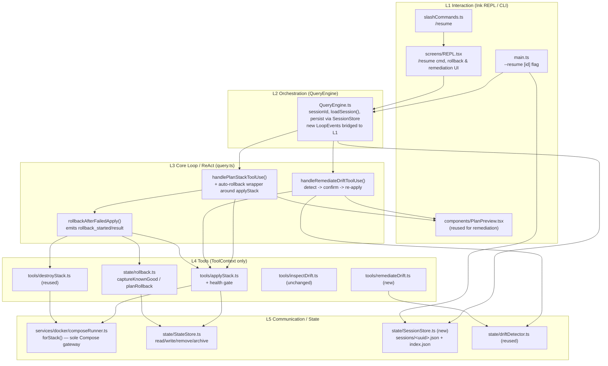
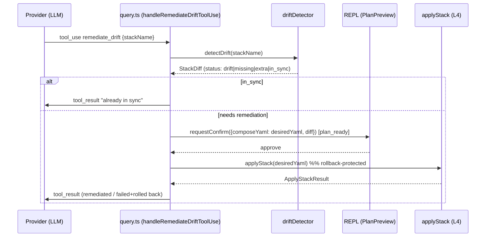
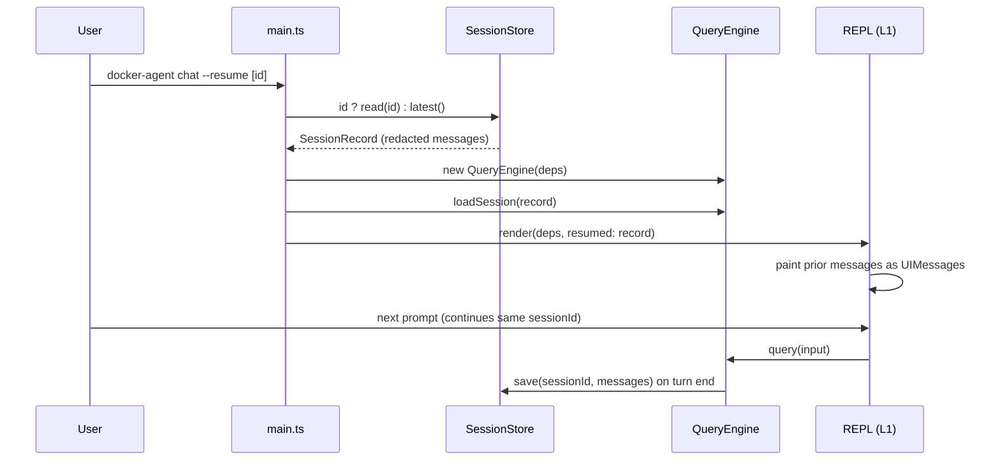

# Design Document: Operational Safety

## Overview

This feature bundle adds three operational-safety capabilities to the existing Docker Agent CLI without changing its 5-layer architecture or its hard invariants (all Compose access via `ComposeRunner.forStack`, tools never touch user-interaction channels, user prompts flow through the deferred-resolver pattern in `QueryEngine`):

1. **Auto-rollback on apply failure** — when an apply (Compose `up -d`) exits non-zero or services fail to become healthy, the system automatically restores the previous known-good state instead of leaving infrastructure broken. Restore is done by re-driving the existing `applyStack`/`destroyStack` tools (so it inherits the `ComposeRunner` invariant for free) and is surfaced to the user via new notification `LoopEvent`s.

2. **Drift remediation** — `inspect_drift` stays detect-only. A new `remediate_drift` tool computes the drift `StackDiff`, then L3 reuses the existing `plan_ready`/`requestConfirm` preview pattern to show the diff and the desired YAML, gets confirmation, and re-applies the desired state through `applyStack` (which now carries rollback safety).

3. **Resume session (`--resume`)** — session transcripts are persisted (redacted) under `.docker-agent/sessions/<uuid>.json` with a lightweight index. A `--resume [sessionId]` CLI flag and a `/resume` slash command rehydrate a prior transcript into `QueryEngine.messages` and repaint it in the REPL so the conversation continues.

All three slot into the established layers: rollback and remediation orchestration live in **L3** (`src/query.ts`) so they can emit `LoopEvent`s and use `requestConfirm`; the mechanical work stays in **L4** tools/helpers behind `ComposeRunner`; resume touches **L1** (`src/main.ts`, `src/screens/REPL.tsx`, `src/slashCommands.ts`) and **L2** (`src/QueryEngine.ts`) plus a new `SessionStore` in the state layer.

---

## Architecture



**Layering rules preserved:**

- L4 tools and `state/rollback.ts` receive only `ToolContext` (`cwd`, `stateStore`, `dockerEngine`, `composeRunner`, `abortSignal`). They never call `requestX`.
- All user interaction (rollback notifications, remediation confirm) is emitted as `LoopEvent`s by L2/L3 and answered via `engine.respondTo(id, answer)`.
- Every Compose invocation goes through `ctx.composeRunner.forStack(stackName, yamlPath)` — rollback and remediation reuse `applyStack`/`destroyStack` rather than spawning Compose, so the CI lint invariant holds automatically.

---

## Sequence Diagrams

### Auto-rollback on apply failure

```mermaid
sequenceDiagram
    participant LLM as Provider (LLM)
    participant L3 as query.ts (handlePlanStackToolUse)
    participant Apply as applyStack (L4)
    participant CR as ComposeRunner
    participant L1 as REPL (L1)

    LLM->>L3: tool_use plan_stack
    L3->>L1: requestConfirm(plan) [plan_ready event]
    L1-->>L3: approve
    L3->>L3: knownGood = captureKnownGood(stackName)
    L3->>Apply: applyStack(desiredYaml)
    Apply->>CR: forStack().up({detach:true})
    CR-->>Apply: exitCode + (health poll)
    Apply-->>L3: { ok:false, exitCode|unhealthyServices }
    L3->>L1: rollback_started {stackName, reason}
    alt restore_previous (UPDATE, prior recoverable)
        L3->>Apply: applyStack(knownGood.previousYaml)  %% restore -> "previous"
        Apply->>CR: forStack().up()
    else teardown_partial (FIRST-TIME CREATE)
        L3->>L3: destroyStack(stackName)  %% clean partial -> "removed"
        L3->>CR: forStack().down()
    else none (UPDATE, prior unrecoverable)
        L3->>L3: abort, leave on-disk state unmodified  %% restored = "none"
    end
    L3->>L1: rollback_result {ok, restored}
    L3->>LLM: tool_result (apply failed; rolled back)
```

### Drift remediation



### Resume session



---

## Components and Interfaces

### Component 1: `state/rollback.ts` (new, L4 helper)

**Purpose**: Pure, `ToolContext`-only helpers to capture the last-known-good stack definition before an apply and to decide how to restore it after a failure. Contains no user interaction.

**Interface**:
```typescript
import type { ToolContext } from "src/Tool";
import type { StackDefinition } from "src/types/stack";

export interface KnownGood {
  /** The recovered prior definition (live file or `.archive` fallback), or null if none was recovered. */
  previous: StackDefinition | null;
  /**
   * True when this apply was an UPDATE that was expected to have a prior definition.
   * False when this apply was a FIRST-TIME CREATE (no prior definition existed or was expected).
   * This distinguishes "did not exist because first-time create" from "expected but unrecoverable".
   */
  existedExpected: boolean;
  /**
   * True when a prior Known_Good definition was actually recovered (from the live stack
   * file or the `.archive/<stack>.yaml` fallback). Always false for a first-time create,
   * and false for an update whose prior state is unrecoverable.
   */
  recoverable: boolean;
  /** YAML serialization of `previous`, ready to feed back into applyStack. Present iff `recoverable`. */
  previousYaml?: string;
}

// Exactly three rollback cases, derived unambiguously from (existedExpected, recoverable):
//   restore_previous : existedExpected && recoverable   (UPDATE with recoverable prior) -> restored = "previous"
//   teardown_partial : !existedExpected                 (FIRST-TIME CREATE)              -> restored = "removed"
//   none             : existedExpected && !recoverable  (UPDATE, prior unrecoverable)    -> restored = "none", abort
export type RollbackPlan =
  | { strategy: "restore_previous"; stackName: string; composeYaml: string }
  | { strategy: "teardown_partial"; stackName: string }
  | { strategy: "none"; reason: string };

/** Capture the current on-disk state BEFORE applyStack overwrites it. */
export function captureKnownGood(stackName: string, ctx: ToolContext): KnownGood;

/** Decide how to roll back given what existed before the failed apply. */
export function planRollback(known: KnownGood, stackName: string): RollbackPlan;
```

**Responsibilities**:
- Read prior definition via `ctx.stateStore.read` (or `.archive/<stack>.yaml` fallback).
- Distinguish a FIRST-TIME CREATE (no prior definition existed or was expected: `existedExpected=false`) from an UPDATE whose prior definition is expected but unrecoverable (`existedExpected=true, recoverable=false`). A recovered UPDATE sets `existedExpected=true, recoverable=true`.
- Serialize a recovered prior definition to YAML for re-apply (`previousYaml`, present iff `recoverable`).
- Never run Compose itself — it only produces a plan the L3 orchestrator executes via existing tools.

### Component 2: `tools/applyStack.ts` (extended, L4)

**Purpose**: Existing apply tool, extended with a **new** health gate so that "services failed to become healthy" is detectable by the orchestrator.

**Interface** — **BREAKING contract extension of `ApplyStackResult`.** Today (verified in `src/tools/applyStack.ts`) the result is exactly `{ ok, exitCode, yamlPath, errorOutput }`. Adding `healthy` and `unhealthyServices` changes that contract, so **every existing caller and test of `applyStack` must be updated**: the L3 apply flow in `src/query.ts` (which reads the result to decide rollback) and the unit tests in `src/tools/__tests__/applyStack.test.ts`. This change is listed in the file change map below.

```typescript
export interface ApplyStackResult {
  // existing fields (unchanged):
  ok: boolean;
  exitCode: number;
  yamlPath: string;
  errorOutput?: string;
  // NEW fields (breaking additions):
  healthy?: boolean;            // false when health gate timed out
  unhealthyServices?: string[]; // services not running/healthy at deadline
}
```

**Responsibilities**:
- After `up` returns exit 0, poll `bound.ps({ json: true })` until all services are `running`/`healthy` or the health deadline elapses (default 120 s, configurable 10..600 s inclusive; poll interval default 2 s, configurable 1..60 s inclusive).
- Set `ok = false`, `healthy = false`, populate `unhealthyServices` when the gate fails.
- Continue to write/update `x-docker-agent.lastApplied` only on full success.

### Component 3: `tools/remediateDrift.ts` (new, L4)

**Purpose**: A high-level tool the LLM can call to request remediation. It computes drift and returns a structured result; the confirm/re-apply orchestration lives in L3 (mirroring `plan_stack`).

**Interface**:
```typescript
export const RemediateDriftInputSchema = z.object({ stackName: z.string() });
export type RemediateDriftInput = z.infer<typeof RemediateDriftInputSchema>;

export interface RemediateDriftResult {
  diff: StackDiff;          // from detectDrift
  desiredYaml: string;      // serialized desired StackDefinition (empty if stack missing)
  remediable: boolean;      // true when status is drift | missing | extra (a desired def exists to re-apply)
  reason?: string;          // why not remediable (e.g., "in_sync", "no desired state")
}

export const remediateDrift: Tool<RemediateDriftInput, RemediateDriftResult>;
// category: "high-level"; needsPermission: () => true
```

**Responsibilities**:
- Call `detectDrift(stackName, ctx.stateStore, ctx.dockerEngine, ctx.cwd)`.
- Read desired `StackDefinition` and serialize via `yaml.stringify`.
- Classify remediability. No Compose calls, no user interaction.

### Component 4: `state/SessionStore.ts` (new, L5/state)

**Purpose**: Persist and load redacted session transcripts plus a lookup index, paralleling `StateStore` conventions (atomic tmp+rename writes, tolerant reads).

**Interface**:
```typescript
export interface SessionRecord {
  schemaVersion: 1;
  id: string;                 // uuid (nanoid)
  createdAt: string;
  updatedAt: string;
  cwd: string;
  provider: string;
  model?: string;
  firstPrompt: string;        // for index display
  stackNames: string[];       // best-effort, parsed from tool calls
  messages: Message[];        // already redacted (see Security)
}

export interface SessionIndexEntry {
  id: string;
  createdAt: string;
  updatedAt: string;
  firstPrompt: string;
  stackNames: string[];
}

export class SessionStore {
  constructor(root: string);                       // <cwd>/.docker-agent
  save(record: SessionRecord): void;               // atomic write + index upsert
  read(id: string): SessionRecord | null;
  latest(): SessionRecord | null;
  list(): SessionIndexEntry[];                      // newest-first
}
```

**Responsibilities**:
- Write `sessions/<id>.json` atomically and upsert `sessions/index.json`.
- Tolerate corrupt/old files (return `null`, warn) just like `StateStore.list()`.

### Component 5: `QueryEngine` (extended, L2)

**Purpose**: Owns the session lifecycle. Adds session id, transcript persistence, and rehydration.

**Interface** (additions):
```typescript
export interface QueryEngineDeps {
  cwd: string;
  stateStore: StateStore;
  sessionStore: SessionStore;     // new
  dockerEngine: EngineClient;
  composeRunner: ComposeRunner;
  provider: Provider;
  model?: string;
}

class QueryEngine {
  get sessionId(): string;                  // generated on construction
  loadSession(record: SessionRecord): void; // rehydrate messages + ids
  getMessages(): readonly Message[];        // for REPL repaint on resume
  // query() now persists transcript on turn completion
}
```

---

## Data Models

### LoopEvent — new notification variants

`src/types/events.ts` gains two **notification** events (no `id`, no `respondTo` needed). They sit alongside the existing deferred-resolver events.

```typescript
export type LoopEvent =
  // ...existing variants unchanged...
  | {
      type: "rollback_started";
      stackName: string;
      reason: "apply_failed" | "unhealthy";
      detail: string;            // e.g. "exit 1" or "unhealthy: db, cache"
    }
  | {
      type: "rollback_result";
      stackName: string;
      ok: boolean;
      restored: "previous" | "removed" | "none";
      detail?: string;
    };
```

No new deferred (`requestX`) event is added — remediation reuses the existing `plan_ready` event and `requestConfirm`.

### HistoryEvent — extended actions

`src/state/StateStore.ts`:
```typescript
export interface HistoryEvent {
  ts: string;
  sessionId: string;
  stackName: string;
  action: "plan" | "apply" | "destroy" | "drift_detected" | "rollback" | "remediate"; // + 2
  details: Record<string, unknown>;
}
```
With `sessionId` now actually populated (passed from `QueryEngine.sessionId` through `ToolContext`) instead of the literal `"unknown"` used today.

### SessionRecord / index

Stored at `.docker-agent/sessions/<id>.json` and `.docker-agent/sessions/index.json` (shapes in Component 4). `messages` is the same `Message[]` type already used by `QueryEngine`, so no schema duplication.

### Validation Rules

- `SessionRecord.schemaVersion` must equal `1`; mismatches are treated as unreadable (skip, warn) so future formats never crash resume.
- `RemediateDriftInput.stackName` non-empty (Zod).
- `ApplyStackResult.unhealthyServices` only present when `healthy === false`.

---

## Algorithmic Pseudocode

### Known-good capture & rollback-plan selection (L4 `state/rollback.ts`)

```typescript
// Capture on-disk state BEFORE applyStack overwrites it, classifying the apply as
// a first-time create vs an update (and, for an update, whether prior state is recoverable).
function captureKnownGood(stackName: string, ctx: ToolContext): KnownGood {
  const live = ctx.stateStore.read(stackName);            // current live definition, or null
  if (live) {
    const yaml = serialize(live);
    return { previous: live, existedExpected: true, recoverable: true, previousYaml: yaml };
  }

  // No live file. Was a prior definition EXPECTED (update) or is this a first-time create?
  const archived = ctx.stateStore.readArchive(stackName); // `.archive/<stack>.yaml`, or null
  if (archived) {
    const yaml = serialize(archived);
    return { previous: archived, existedExpected: true, recoverable: true, previousYaml: yaml };
  }
  if (ctx.stateStore.hasArchiveMarker(stackName)) {
    // Update was expected (a definition existed at some point) but nothing is recoverable.
    return { previous: null, existedExpected: true, recoverable: false };
  }
  // Genuine first-time create: no prior definition existed or was expected.
  return { previous: null, existedExpected: false, recoverable: false };
}

// Map the captured state to exactly one of the three rollback cases.
function planRollback(known: KnownGood, stackName: string): RollbackPlan {
  if (known.existedExpected && known.recoverable) {
    // UPDATE with recoverable prior -> re-apply previous (restored = "previous").
    return { strategy: "restore_previous", stackName, composeYaml: known.previousYaml! };
  }
  if (!known.existedExpected) {
    // FIRST-TIME CREATE -> tear down partial stack (restored = "removed").
    return { strategy: "teardown_partial", stackName };
  }
  // UPDATE expected but neither live file nor archive recoverable -> abort (restored = "none").
  return { strategy: "none", reason: "no recoverable prior state (live file and archive both unavailable)" };
}
```

### Auto-rollback wrapper (L3, inside `handlePlanStackToolUse` and the remediation path)

```typescript
async function* applyWithRollback(
  stackName: string,
  desiredYaml: string,
  scaleOverrides: Record<string, number> | undefined,
  ctx: LoopContext,
): AsyncGenerator<LoopEvent, { ok: boolean; resultMessage: string }> {
  // PRECONDITION: desiredYaml parses to a valid StackDefinition; lock not yet held.
  const known = captureKnownGood(stackName, ctx);            // BEFORE applyStack overwrites state

  const applyResult = yield* runTool(applyStack, {
    stackName, composeYaml: desiredYaml,
    ...(scaleOverrides ? { scaleOverrides } : {}),
  }, ctx);

  if (applyResult.ok) {
    return { ok: true, resultMessage: "Stack applied." };
  }

  // Determine failure reason for the notification.
  const reason = applyResult.healthy === false ? "unhealthy" : "apply_failed";
  const detail = reason === "unhealthy"
    ? `unhealthy: ${(applyResult.unhealthyServices ?? []).join(", ")}`
    : `exit ${applyResult.exitCode}: ${applyResult.errorOutput ?? "unknown"}`;

  yield { type: "rollback_started", stackName, reason, detail };

  const plan = planRollback(known, stackName);
  let restored: "previous" | "removed" | "none" = "none";
  let rollbackOk = true;

  try {
    if (plan.strategy === "restore_previous") {
      // CASE restore_previous: apply was an UPDATE with a recoverable prior Known_Good
      // (live file or archive). Re-apply it and report restored = "previous".
      const restore = yield* runTool(applyStack, {
        stackName, composeYaml: plan.composeYaml,
      }, ctx);
      rollbackOk = restore.ok;
      restored = "previous";
    } else if (plan.strategy === "teardown_partial") {
      // CASE teardown_partial: apply was a FIRST-TIME CREATE (no prior definition existed).
      // Tear down the partial stack and report restored = "removed".
      const down = yield* runTool(destroyStack, { stackName }, ctx);
      rollbackOk = down.ok;
      restored = "removed";
    } else {
      // CASE none: apply was an UPDATE expecting a prior definition, but neither the live
      // file nor the archive is recoverable. Abort: leave on-disk state UNMODIFIED, do not
      // run any Compose op, keep restored = "none", advise manual intervention.
      rollbackOk = false;
    }
  } catch (err) {
    rollbackOk = false;
  }

  ctx.stateStore.appendHistory({
    ts: new Date().toISOString(), sessionId: ctx.sessionId ?? "unknown",
    stackName, action: "rollback",
    details: { reason, restored, rollbackOk },
  });

  yield { type: "rollback_result", stackName, ok: rollbackOk, restored,
          ...(rollbackOk ? {} : { detail: "manual intervention may be required" }) };

  // POSTCONDITION: infra is either at previous good state (restored) or torn down (removed);
  // never left in the half-applied failed state when rollbackOk === true.
  return {
    ok: false,
    resultMessage: `apply failed (${detail}); rollback ${rollbackOk ? "succeeded" : "FAILED"} (${restored}).`,
  };
}
```

**Preconditions:**
- `desiredYaml` is a valid Compose v3 + `x-docker-agent` document.
- `ctx.composeRunner`, `ctx.stateStore` available; no stack lock currently held by this flow.

**Postconditions:**
- On apply success: stack is applied and `lastApplied` updated (unchanged behavior).
- On apply failure with `rollbackOk`: running infra equals the previous known-good (update) or is fully removed (first-time create) — never the broken half-state.
- On rollback failure: a `rollback_result { ok:false }` event is emitted and a clear tool message is returned; the flow does not retry-loop.

**Loop invariants:** none (linear flow). Health polling invariants are in `verifyHealth` below.

### Health gate (L4, inside `applyStack` after `up` exit 0)

```typescript
// Canonical health-gate configuration — single source of truth, do not redefine elsewhere:
//   deadline       default 120 s, configurable in the range 10..600 s inclusive
//   poll interval  default 2 s,   configurable in the range 1..60 s inclusive
const HEALTH_DEADLINE_MS = clamp(configuredDeadlineMs ?? 120_000, 10_000, 600_000); // 10..600 s
const POLL_INTERVAL_MS   = clamp(configuredPollMs ?? 2_000, 1_000, 60_000);          // 1..60 s

async function verifyHealth(
  bound: BoundComposeRunner,
  expectedServices: string[],
  deadlineMs: number,          // HEALTH_DEADLINE_MS (clamped to 10..600 s, default 120 s)
  abort: AbortSignal,
): Promise<{ healthy: boolean; unhealthy: string[] }> {
  const deadline = Date.now() + deadlineMs;
  while (true) {
    // INVARIANT: every iteration either returns or sleeps; abort/deadline guarantee termination.
    if (abort.aborted) return { healthy: false, unhealthy: expectedServices };

    const rows = await bound.ps({ json: true });   // ComposeRunner — invariant preserved
    const unhealthy = expectedServices.filter((svc) => {
      const row = rows.find((r) => r.Service === svc);
      if (!row) return true;                         // not up yet
      if (row.Health) return row.Health !== "healthy";
      return row.State !== "running";                // no healthcheck -> require running
    });

    if (unhealthy.length === 0) return { healthy: true, unhealthy: [] };
    if (Date.now() >= deadline) return { healthy: false, unhealthy };
    await sleep(POLL_INTERVAL_MS);
  }
}
```

**Preconditions:** `up` already exited 0; `expectedServices` = `Object.keys(def.services)`; `deadlineMs` is the canonical health deadline (default 120 s, configurable 10..600 s inclusive) and the poll interval is the canonical interval (default 2 s, configurable 1..60 s inclusive).
**Postconditions:** returns `healthy:true` iff every expected service is `running`/`healthy`; otherwise lists laggards.
**Loop invariant:** each pass strictly advances toward the deadline; `abort` or `Date.now() >= deadline` guarantees exit (no infinite poll).

### Remediation flow (L3, new `handleRemediateDriftToolUse`, mirrors `handlePlanStackToolUse`)

```typescript
async function* handleRemediateDriftToolUse(
  tu: CollectedToolUse,
  ctx: LoopContext,
): AsyncGenerator<LoopEvent, { isError: boolean; resultMessage: string }> {
  const parsed = remediateDrift.inputSchema.parse(JSON.parse(tu.argsPartial || "{}"));
  const result = yield* runTool(remediateDrift, parsed, ctx);   // detectDrift + serialize

  if (!result.remediable) {
    return { isError: false, resultMessage: `No remediation needed: ${result.reason}` };
  }

  // Reuse the existing plan preview + deferred-resolver confirm pattern.
  const confirm = await ctx.requestConfirm({
    composeYaml: result.desiredYaml,
    diff: result.diff,                       // StackDiff drives PlanPreview's diff rendering
  });
  if (confirm.kind !== "approve") {
    return { isError: false, resultMessage: "User declined remediation." };
  }

  // Re-apply desired state THROUGH applyStack -> ComposeRunner, with rollback protection.
  const r = yield* applyWithRollback(parsed.stackName, result.desiredYaml, undefined, ctx);

  // For `extra`, re-applying desired state does NOT remove orphan (extra) services.
  // Report the count + identifiers of remaining orphans; remediation is NOT fully clean
  // while any orphan remains. Automatic orphan removal (compose --remove-orphans / a
  // destroy path) is OUT OF SCOPE — documented as a possible future feature.
  let resultMessage = r.resultMessage;
  let fullyClean = r.ok;
  if (result.diff.status === "extra") {
    // Orphans = services present live (actual) but not in desired state.
    const orphans = result.diff.serviceDiffs
      .filter((d) => d.desired === null && d.actual !== null)
      .map((d) => d.service);
    if (orphans.length > 0) {
      fullyClean = false;
      resultMessage += ` Remediation not fully clean: ${orphans.length} orphan service(s) remain `
        + `(${orphans.join(", ")}). Automatic orphan removal is out of scope (future option).`;
    }
  }

  ctx.stateStore.appendHistory({
    ts: new Date().toISOString(), sessionId: ctx.sessionId ?? "unknown",
    stackName: parsed.stackName, action: "remediate",
    details: { status: result.diff.status, ok: r.ok, fullyClean },
  });
  return { isError: !r.ok, resultMessage };
}
```

`remediate_drift` is wired in `src/query.ts`'s tool dispatch the same way `plan_stack` and `destroy_all_stacks` are special-cased, and registered in `getToolsForMode("react")` and `getAllTools()`.

**Preconditions:** `stackName` exists in state for `drift`/`missing`/`extra` (any status with a recoverable desired definition); if no desired definition is available the tool returns `remediable:false`.
**Postconditions:** on approve, desired state is re-applied (rollback-protected); on decline, no Compose calls happen. For `extra`, the re-apply reconciles desired services but does NOT remove orphan (extra) services — remaining orphans are reported and the outcome is reported as not fully clean (see Error Handling); automatic orphan removal is out of scope.

### Resume loading (L2 `QueryEngine.loadSession` + L1 `main.ts`)

```typescript
// L2
loadSession(record: SessionRecord): void {
  // PRECONDITION: record.schemaVersion === 1 (validated by SessionStore.read)
  this.messages = [...record.messages];   // redacted transcript
  this.resumedId = record.id;             // continue persisting to the SAME file
  this.pending.clear();
  this.sessionAllowSet.clear();           // permissions are never resumed (safety)
  // POSTCONDITION: next query() appends to restored history and saves under record.id
}

// L1 main.ts (chat command)
async function resolveResume(args: ParsedArgs, sessionStore: SessionStore): SessionRecord | null {
  if (!args.resume) return null;
  const rec = typeof args.resume === "string" ? sessionStore.read(args.resume)
                                              : sessionStore.latest();
  if (!rec) {
    process.stderr.write(args.resume === true
      ? "No previous session found to resume.\n"
      : `Session ${args.resume} not found.\n`);
  }
  return rec;
}
```

The REPL receives the resumed record, calls `engine.loadSession(record)` once, and rebuilds `UIMessage[]` from `record.messages` (user text, assistant text blocks, tool blocks marked `done`) so the user sees prior context. The `/resume` slash command performs the same `read`/`latest` + `loadSession` + repaint without restarting the process.

**Preconditions:** session file exists and is schema v1.
**Postconditions:** `engine.getMessages()` equals the restored transcript; subsequent turns persist back to the same `id`; no permission allow-set is carried over.

---

## Key Functions with Formal Specifications

### `captureKnownGood(stackName, ctx): KnownGood`
- **Preconditions:** `ctx.stateStore` initialized.
- **Postconditions:** classifies the apply into exactly one shape:
  - first-time create (no prior definition existed or was expected): `existedExpected === false`, `recoverable === false`, `previous === null`.
  - update with recoverable prior: `existedExpected === true`, `recoverable === true`, `previousYaml` is a faithful re-serialization of the prior on-disk def (falls back to `.archive/<stack>.yaml` if the live file was already removed).
  - update expected but unrecoverable (live file and archive both unavailable): `existedExpected === true`, `recoverable === false`, `previous === null`.
  - No mutation, no I/O beyond reads.

### `planRollback(known, stackName): RollbackPlan`
- **Preconditions:** `known` produced by `captureKnownGood` in the same flow.
- **Postconditions:** returns exactly one of three plans, unambiguously derived from `(existedExpected, recoverable)`:
  - `restore_previous` iff `known.existedExpected && known.recoverable` (UPDATE, prior recoverable).
  - `teardown_partial` iff `!known.existedExpected` (FIRST-TIME CREATE).
  - `none` iff `known.existedExpected && !known.recoverable` (UPDATE expected but neither live file nor archive recoverable); carries a non-empty `reason`.

### `applyStack.call(...)` (extended)
- **Preconditions (unchanged):** valid `composeYaml`; env-file git hygiene passes; images valid.
- **Postconditions (new):** result `ok === (exitCode === 0 && healthy === true)`; `lastApplied` written only when `ok`; `unhealthyServices` set iff `healthy === false`.
- **Loop invariant:** the health-poll loop terminates by deadline or abort (see `verifyHealth`).

### `SessionStore.save(record)`
- **Preconditions:** `record.id` non-empty; `record.messages` redacted.
- **Postconditions:** `sessions/<id>.json` written atomically (tmp+rename); `index.json` contains exactly one entry per id (upsert); secret values never written (guaranteed upstream; see Security).

---

## Example Usage

```typescript
// 1. Auto-rollback (transparent): a failed apply restores prior state.
//    REPL renders rollback_started then rollback_result; no extra user action.
//
//    rollback_started { stackName: "webapp", reason: "unhealthy", detail: "unhealthy: db" }
//    rollback_result  { stackName: "webapp", ok: true, restored: "previous" }

// 2. Drift remediation via natural language:
//    user: "fix the drift on webapp"
//    -> LLM calls remediate_drift { stackName: "webapp" }
//    -> PlanPreview shows StackDiff + desired YAML
//    -> user approves -> applyStack re-applies desired (rollback-protected)

// 3. Resume:
//    $ docker-agent chat --resume            # most recent session
//    $ docker-agent chat --resume 9f3a...    # specific session id
//    in-REPL:  /resume            -> reload latest into current REPL
//              /resume 9f3a...    -> reload a specific session
```

---

## Correctness Properties

Property 1: Compose-runner invariant. For every Compose operation performed by rollback or remediation, it is issued via `ctx.composeRunner.forStack(...)` (because both reuse `applyStack`/`destroyStack`). No new `spawn`/`docker compose` call sites are introduced.

**Validates: Requirements 13.1, 13.2, 13.5**

Property 2: No broken half-state. For every apply that fails (non-zero exit or unhealthy) where rollback succeeds, the resulting running infrastructure equals either the previous known-good state (update) or the empty state (first-time create).

**Validates: Requirements 1.1, 4.1, 4.2, 4.6**

Property 3: Idempotent remediation. For every stack with `status === "in_sync"`, `remediate_drift` performs no Compose calls and reports "already in sync".

**Validates: Requirements 6.3, 7.1**

Property 4: Confirmation gating. For every remediation re-apply, a `plan_ready` event was emitted and an `approve` `PermissionResponse` was received first (declines cause zero Compose calls).

**Validates: Requirements 6.4, 6.5, 6.7**

Property 5: Layer isolation. For every L4 tool/helper added (`remediateDrift`, `state/rollback.ts`), it depends only on `ToolContext`; it never references `requestPermission`/`requestConfirm`/`requestTypedConfirm`/`requestSecretsInput`.

**Validates: Requirements 6.8, 13.3, 13.4**

Property 6: Transcript secrecy. For every persisted `SessionRecord`, no secret value (matching `SECRET_KEY_PATTERN`) appears in `messages`; resume restores only redacted content.

**Validates: Requirements 10.4, 10.5, 11.3**

Property 7: Resume fidelity. For every valid schema-v1 session record `r`, after `loadSession(r)`, `engine.getMessages()` deep-equals `r.messages`, and the permission allow-set is empty.

**Validates: Requirements 8.3, 11.1**

Property 8: Health-gate termination. For every apply, `verifyHealth` returns within `deadlineMs` or on abort (never loops forever).

**Validates: Requirements 3.1, 3.4**

Property 9: Rollback strategy completeness. For every failed apply, `planRollback` returns exactly one of `restore_previous` (UPDATE with recoverable prior, restored `previous`), `teardown_partial` (first-time create, restored `removed`), or `none` (UPDATE expected but unrecoverable, restored `none`, no Compose op).

**Validates: Requirements 4.3, 4.4, 4.8, 1.6**

Property 10: Orphan reporting for `extra`. For every remediation of a stack whose status is `extra` that leaves one or more orphan services, the outcome is reported as not fully clean and the orphan identifiers are reported; no automatic orphan removal is performed.

**Validates: Requirements 7.5, 7.7, 7.8**

---

## Error Handling

| Layer | Condition | Handling |
|---|---|---|
| L3 rollback | `applyStack` returns non-zero exit | Emit `rollback_started`, run `planRollback`, restore/teardown via existing tools, emit `rollback_result`. |
| L3 rollback | Services never become healthy | Same path with `reason: "unhealthy"` and `unhealthyServices` in `detail`. |
| L3 rollback | Rollback itself fails (restore/teardown non-zero or throws) | Emit `rollback_result { ok:false }`, return a tool message advising manual intervention; **do not** retry-loop. |
| L4 applyStack | Lock held by another process | Existing `acquireLock(timeoutMs)` behavior; rollback re-acquires the lock for its own restore apply (lock is released between the failed apply and rollback). |
| L4 rollback | No live file and no archive | `planRollback` returns `strategy:"none"`; `rollback_result { ok:false, restored:"none" }`. |
| L3 remediation | Stack missing / no desired YAML | `remediateDrift` returns `remediable:false`, reason surfaced; no confirm shown. |
| L3 remediation | `status === "extra"` (orphan services) | `applyStack` re-applies the desired state (reconciling declared services). Remaining orphan services are **reported** (count + identifiers) and the remediation is reported as **not fully clean** while any orphan remains. Automatic orphan removal (`compose --remove-orphans` or a destroy path) is explicitly **out of scope** and documented as a possible future feature. |
| L1/L2 resume | Session id not found | `--resume <id>` prints "Session not found"; `/resume <id>` shows an error message in the REPL; chat starts fresh. |
| L1/L2 resume | Corrupt or wrong-schema session file | `SessionStore.read` returns `null` and warns (mirrors `StateStore.list` tolerance); chat starts fresh. |
| L2 persist | `sessions/` write fails | Atomic tmp+rename keeps any prior file intact; warn, continue (a failed save never aborts the turn). |

---

## Testing Strategy

### Unit Testing (vitest, co-located `__tests__`)

- `state/rollback.test.ts` — `captureKnownGood` (existing / missing / archive-fallback) and `planRollback` strategy selection.
- `tools/applyStack.test.ts` — extend with health-gate cases using `MockComposeRunner.ps` returning unhealthy then healthy rows; assert `unhealthyServices`/`healthy`.
- `tools/remediateDrift.test.ts` — `in_sync`/`drift`/`missing`/`extra` classification with `MockDockerEngine` + `StateStore`.
- `state/SessionStore.test.ts` — save/read/latest/list, atomic write, corrupt-file tolerance, schema-version guard.

### Integration / loop Testing

- `query` loop with a `replayProvider` fixture that triggers a failing apply → assert ordered events `rollback_started` then `rollback_result`, and that `MockComposeRunner` only ever saw `forStack(...)` calls (invariant test extended).
- Remediation: replay provider calls `remediate_drift`; assert `plan_ready` confirm emitted, approve leads to re-apply, decline leads to zero `up` calls.
- `QueryEngine` resume: persist a transcript, construct a new engine, `loadSession`, assert `getMessages()` equals saved messages and `sk_`/password values are absent from the serialized record.

### Property-Based Testing

**Library**: fast-check (matches the TypeScript/vitest stack).

- Property 6 (transcript secrecy): for arbitrary env maps containing keys matching `SECRET_KEY_PATTERN`, the persisted `SessionRecord` JSON never contains the raw value.
- Property 7 (resume fidelity): for arbitrary `Message[]`, `loadSession(save→read)` round-trips deep-equal.
- Property 8 (health-gate termination): for arbitrary `ps` row sequences, `verifyHealth` resolves before/at deadline.

### CI invariant test (existing)

The existing lint test that forbids direct `docker compose` spawning is extended to cover the new files; rollback/remediation pass because they reuse `applyStack`/`destroyStack`.

---

## Security Considerations

- **Transcript redaction.** `messages` already exclude secret values (the LLM never receives them; tool outputs are scrubbed via `scrubLine`). `SessionStore` adds a belt-and-suspenders pass: before writing, it runs each tool message through the redactor keyed by the stack's secret keys, so even accidental leakage is caught. Auto-generated and user-typed secrets (`secrets_input_values`) never enter `messages` and therefore never reach the session file.
- **Permissions are not resumed.** `loadSession` clears `sessionAllowSet`; a resumed session re-prompts for every permission and typed confirm, so resume cannot silently re-grant destructive approvals.
- **File modes.** Session files inherit `.docker-agent` directory hygiene; no secret material is written, so standard `0o644` is acceptable (consistent with `history.json`).
- **Rollback safety.** Rollback only ever re-applies a previously stored definition or tears the stack down; it never fabricates new YAML, so it cannot introduce unreviewed configuration.

---

## Dependencies

No new runtime dependencies. Reuses the existing stack: `commander` (CLI flag), `yaml` (serialize desired/known-good defs), `zod` (`RemediateDriftInputSchema`), `nanoid` (session ids), `dockerode`/`ComposeRunner` (existing Docker access), `vitest` + `fast-check` (tests), `biome` (lint/format).

### File change map

| File | Change |
|---|---|
| `src/types/events.ts` | Add `rollback_started`, `rollback_result` LoopEvent variants. |
| `src/state/StateStore.ts` | Extend `HistoryEvent.action` with `"rollback" \| "remediate"`. |
| `src/state/rollback.ts` | **New** — `captureKnownGood`, `planRollback`. |
| `src/state/SessionStore.ts` | **New** — persist/load transcripts + index. |
| `src/tools/applyStack.ts` | Add **new** health gate (`verifyHealth`); **breaking** extension of `ApplyStackResult` with `healthy`/`unhealthyServices`. |
| `src/tools/__tests__/applyStack.test.ts` | Update existing tests for the extended `ApplyStackResult` contract (breaking change); add health-gate cases. |
| `src/tools/remediateDrift.ts` | **New** — drift→desired-YAML tool. |
| `src/tools.ts` | Register `remediateDrift` in `getAllTools`/`getToolsForMode("react")`. |
| `src/query.ts` | `applyWithRollback` wrapper (consumes the extended `ApplyStackResult` `healthy`/`unhealthyServices` — breaking-change caller); `handleRemediateDriftToolUse`; dispatch `remediate_drift`; thread `sessionId` into history. |
| `src/loopContext.ts` / `src/Tool.ts` | Add optional `sessionId` to context for history attribution. |
| `src/QueryEngine.ts` | `sessionStore` dep, `sessionId`, `loadSession`, `getMessages`, persist on turn end. |
| `src/main.ts` | `--resume [id]` option; `createDeps` builds `SessionStore`; resolve+inject resumed record. |
| `src/screens/REPL.tsx` | Render rollback events; repaint resumed transcript; handle `/resume`. |
| `src/slashCommands.ts` | Add `/resume` suggestion. |
