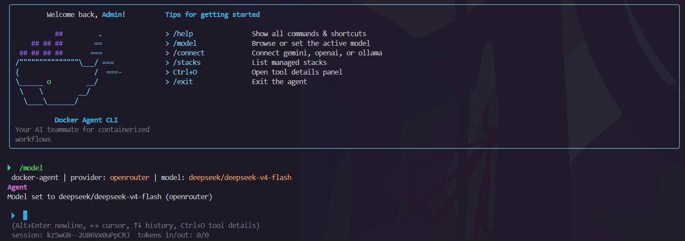

# Docker Agent CLI

[](https://opensource.org/licenses/MIT)
[](https://nodejs.org/)

An advanced, natural-language Command Line Interface (CLI) powered by an LLM agent using the **ReAct** (Reasoning + Acting) pattern to autonomously manage and provision Docker infrastructure.

Instead of writing complex `docker-compose.yaml` files, configuring networks, volumes, and secrets manually, you can simply ask the Docker Agent in plain English (or Vietnamese) to orchestrate it for you.

---



## Key Features

- **Natural Language Infrastructure Provisioning**: Tell the agent what you want to build (e.g., *"Set up an Nginx reverse proxy routing to two Node.js backend replicas and a PostgreSQL database"*).
- **ReAct Agent Architecture**: The agent reasons through your request, plans a Docker Compose stack, requests approval, and applies it. Planning-heavy requests run in a single-turn mode; follow-up tasks use a multi-iteration ReAct loop (up to 12 turns).
- **Interactive REPL Interface**: A terminal UI built with **Ink** (React in the terminal) with real-time streaming, permission dialogs, plan previews with visual diffs, and an activity timeline.
- **Interactive Execution Plans & Visual Diffs**: Displays the generated Compose spec and a diff of changed services, ports, volumes, and environment variables *before* any changes are applied.
- **Automated & Secure Secrets Management**:
  - Automatically identifies necessary credentials (e.g., database passwords, API tokens).
  - Securely prompts you to input them or automatically generates strong random values.
  - Keeps stack secrets isolated in `.docker-agent/secrets/*.env`, decoupled from the main stack YAML.
- **Secure API Key Storage**: LLM provider keys can be saved via `/connect` into the OS credential store (Windows DPAPI, macOS Keychain, Linux Secret Service) — not only environment variables.
- **Real-Time Drift Detection & Remediation**: Compares desired stack state against running containers and can remediate configuration drift.
- **Image Validation**: Validates image references against local Docker and remote registries before apply; can pre-pull missing images.
- **Session Resume**: Conversation transcripts are persisted per project; resume the latest or a specific session with `/resume` or `--resume`.
- **Headless Mode**: Non-interactive `status`, `destroy`, and `plan` subcommands for scripting and CI.
- **Multi-Provider LLM Support**: Works with **Google Gemini**, **OpenAI GPT**, or local models via **Ollama**.

---

## Prerequisites

Before running the Docker Agent CLI, ensure you have:

1. **Node.js** (version `>= 20.x`) installed.
2. **Docker Engine** & **Docker Compose** installed and running on your local machine.
3. Access to an LLM provider:
   - API key for Gemini or OpenAI (via env var or `/connect` in the REPL), or
   - A running local Ollama instance.

---

## Quick Start

```bash
git clone https://github.com/NeoCyber05/Docker-Agent-CLI.git
cd Docker-Agent-CLI
npm install
```

---

## Configuration

### Global Config File

Save preferences in a JSON file:

- **Default path**: `~/.docker-agent/config.json`
- **Custom path**: `DOCKER_AGENT_CONFIG` environment variable

#### Configuration schema (`config.json`)

```json
{
  "provider": "gemini",
  "model": "gemini-2.0-flash",
  "defaults": {
    "autoApproveNonDestructive": false
  }
}
```

| Field | Values | Notes |
| :--- | :--- | :--- |
| `provider` | `gemini` \| `openai` \| `ollama` | Default LLM provider |
| `model` | string or omitted | Provider-specific model override |
| `defaults.autoApproveNonDestructive` | boolean | Reserved for future use |

### Default models (when not set in config or `--model`)

| Provider | Default model | Env override |
| :--- | :--- | :--- |
| Gemini | `gemini-2.0-flash` | `GEMINI_MODEL` |
| OpenAI | `gpt-4o-mini` | `OPENAI_MODEL` |
| Ollama | `qwen2.5:14b` | `OLLAMA_MODEL` |

### State Directory Structure

The CLI maintains project-local state in `.docker-agent` under your current working directory:

```text
.docker-agent/
├── stacks/              # Saved YAML definitions of active stacks
│   └── .archive/        # Archived configs of destroyed/previous stacks
├── sessions/            # Persisted conversation transcripts
│   ├── index.json       # Session index for /resume
│   └── <id>.json        # Individual session records (secrets redacted)
├── locks/               # Process locks to prevent concurrent mutations
├── secrets/             # Per-stack .env files (mode 0700)
├── logs/                # Stack log artifacts
└── history.json         # Audit log (plan, apply, destroy, drift, rollback)
```

API keys saved via `/connect` are stored separately under `~/.docker-agent/api-keys` (Windows) or the OS keychain/secret service (macOS/Linux). Override the Windows storage path with `DOCKER_AGENT_SECRET_DIR`.

---

## CLI Commands

### Interactive (default)

| Command / Option | Description |
| :--- | :--- |
| `docker-agent` or `docker-agent chat` | Start the interactive REPL |
| `--provider <name>` | LLM provider: `gemini`, `openai`, or `ollama` |
| `--model <id>` | Model override for the session |
| `-y, --yes` | Auto-approve non-destructive permissions (destructive tools still gated) |
| `--resume [id]` | Resume the latest session, or a specific session by id |
| `-v, --version` | Print version |
| `-h, --help` | Show help |

### Headless subcommands

Non-interactive commands stream agent output to stdout and auto-respond to prompts based on flags:

| Command | Description |
| :--- | :--- |
| `docker-agent status [stack]` | Show container status and drift (all stacks if omitted) |
| `docker-agent plan <intent...>` | Generate a plan for the given intent (plan preview only; does not apply) |
| `docker-agent destroy <stack>` | Tear down a stack |
| `docker-agent destroy <stack> --volumes` | Tear down a stack and remove volumes |
| `docker-agent destroy --all --confirm "DESTROY ALL"` | Destroy every managed stack (requires exact phrase) |

Headless mode denies secret-input prompts — use the interactive REPL when a plan requires new credentials.

Examples:

```bash
npm run dev -- status my-web-app
npm run dev -- plan deploy nginx with two node backends and postgres
npm run dev -- destroy redis-cache --volumes -y
npm run dev -- destroy --all --confirm "DESTROY ALL" -y
```

---

## Slash Commands (REPL)

Shortcut commands available inside the interactive shell:

| Command | Action |
| :--- | :--- |
| `/help` | List all slash commands |
| `/connect` | Connect a provider (enter API key or configure Ollama) |
| `/models` | Browse and select a model for the active provider |
| `/model <id>` | Set model override (`/model openai/gpt-4o` also switches provider) |
| `/stacks` | List managed stacks |
| `/status <stack>` | Show status and drift for a stack |
| `/yaml <stack>` | Print the stack's Compose YAML |
| `/logs <stack> [service]` | Live-tail stack logs (Esc to stop) |
| `/destroy <stack>` | Tear down one stack |
| `/destroy all` | Tear down all stacks (requires typed `DESTROY ALL` confirmation) |
| `/secrets list <stack>` | List secret env keys (values masked) |
| `/secrets rotate <stack> <service>` | Rotate secrets for a service |
| `/resume` | Resume the most recent session |
| `/resume <id>` | Resume a specific session by id |
| `/cancel` | Cancel the current agent turn (`Ctrl+C`) |
| `/details` | Toggle details panel for the latest tool run (`Ctrl+O`) |
| `/queue resume` | Resume processing queued prompts |
| `/queue clear` | Clear the prompt queue |
| `/queue remove <index>` | Remove a queued prompt (1-based index) |
| `/clear` | Reset conversation context and clear the screen |
| `/quit` or `/exit` | Exit the REPL (`exit` / `quit` without slash also works) |

---

## Agent Tools

The LLM agent can call these tools during a session:

| Tool | Category | Purpose |
| :--- | :--- | :--- |
| `plan_stack` | high-level | Design a stack and show a plan preview |
| `apply_stack` | high-level | Apply an approved plan (runs after plan confirmation) |
| `destroy_stack` | high-level | Tear down one stack |
| `destroy_all_stacks` | high-level | Tear down all stacks (requires `DESTROY ALL`) |
| `list_stacks` | read-only | List stacks in `.docker-agent/stacks/` |
| `get_stack_status` | read-only | Container status for a stack |
| `get_logs` | read-only | Fetch container logs |
| `get_health` | read-only | Health-check status |
| `inspect_drift` | read-only | Compare desired vs running state |
| `remediate_drift` | high-level | Reconcile drift back to desired state |
| `pull_image` | escape-hatch | Validate and pre-pull a Docker image |
| `exec_docker` | escape-hatch | Run read-only `docker` subcommands (`ps`, `inspect`, `logs`, etc.) |

Destructive tools (`apply_stack`, `destroy_stack`, `destroy_all_stacks`) require explicit approval in the REPL. `--yes` auto-approves only non-destructive permissions.

---

## Prompt Examples

Chat with the agent in plain language:

**Creating stacks**

> *"Tạo một ứng dụng web gồm nginx reverse proxy, 2 backend instance node.js, và một cơ sở dữ liệu postgresql."*
>
> *"Deploy a simple Redis instance exposing port 6379."*

**Inspecting & checking status**

> *"Kiểm tra xem stack my-web-app có bị drift (lệch cấu hình) không?"*
>
> *"What is the status of my database stack?"*

**Destroying infrastructure**

> *"Hãy xoá stack redis-cache đi."*

---

## Development

```bash
npm run dev          # interactive REPL with hot reload
npm run build        # bundle to dist/cli.js (copies prompts/)
```

Install globally after building:

```bash
npm run build
npm link
# Now `docker-agent` is available globally
node dist/cli.js     # or run the built bundle directly
```

---

## License

This project is licensed under the MIT License. See the [LICENSE](LICENSE) file for details.

---

*Dự án đang trong giai đoạn phát triển hoàn thiện.*