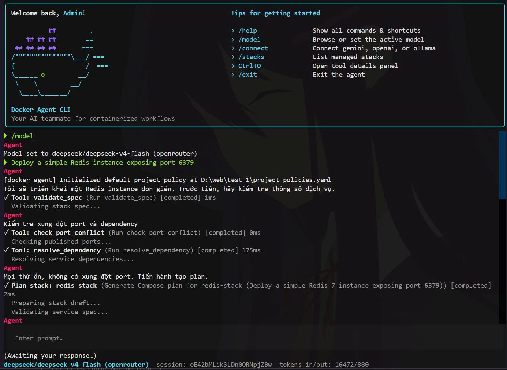

# Docker Agent CLI

[](https://opensource.org/licenses/MIT)
[](https://www.python.org/)
[](https://github.com/langchain-ai/langgraph)
[](https://github.com/Textualize/textual)
[](https://www.docker.com/)
[](https://docs.pydantic.dev/)

An advanced, natural-language Command Line Interface (CLI) powered by an LLM agent using the **ReAct** (Reasoning + Acting) pattern to autonomously manage and provision Docker infrastructure.

Instead of writing complex `docker-compose.yaml` files, configuring networks, volumes, and secrets manually, you can simply ask the Docker Agent in plain language to orchestrate it for you.

---




## Prerequisites

Before running the Docker Agent CLI, ensure you have:

1. **Python 3.11+** and [uv](https://docs.astral.sh/uv/) (or another Python environment manager).
2. **Docker Engine** & **Docker Compose** installed and running on your local machine.
3. Access to an LLM provider:
   - API key for Gemini, OpenAI, or OpenRouter (via env var or `/connect` in the REPL), or
   - A running local Ollama instance.

---

## Installation

Clone the repo, install the CLI globally, then run it from any directory:

```bash
git clone https://github.com/NeoCyber05/Docker-Agent-CLI.git
cd Docker-Agent-CLI
uv tool install -e .
```

Open a new terminal, then:

```bash
docker-agent
```

To upgrade after pulling changes:

```bash
uv tool install --force -e .
```

To remove the global command:

```bash
uv tool uninstall docker-agent
```

---

## Configuration

User preferences are stored in `~/.docker-agent/config.json` (override with `DOCKER_AGENT_CONFIG`):

| Field | Purpose |
| :--- | :--- |
| `provider` | LLM provider used on startup (default: `gemini`) |
| `model` | Preferred model id (optional) |
| `theme` | TUI theme |
| `defaults` | Policy and approval defaults |

On startup, the REPL loads `provider` and `model` from this file. Choosing a model via `/model` or the model picker **saves** your choice for the next session.

**Provider resolution order:** `--provider` flag → `DOCKER_AGENT_PROVIDER` env → `config.json` → `gemini`.

**One-time overrides:** `--provider` and `--model` apply only to the current launch and do not update `config.json`.

### Provider fallback models

When no explicit model is set (in config, CLI flags, or a resumed session), each provider falls back to:

| Provider | Fallback model | Env override |
| :--- | :--- | :--- |
| Gemini | `gemini-2.0-flash` | `GEMINI_MODEL` |
| OpenAI | `gpt-4o-mini` | `OPENAI_MODEL` |
| OpenRouter | `openai/gpt-4o-mini` | `OPENROUTER_MODEL` |
| Ollama | `qwen2.5:14b` | `OLLAMA_MODEL` |

The REPL footer shows this fallback name (not a generic `default` label) when no model override is active.

### State Directory Structure

Project-local state splits across two directories under your working directory: `docker-stacks/` (desired-state Compose YAML) and `.docker-agent/` (sessions, secrets, locks, logs, archive). See [docs/docker-agent-directory.md](docs/docker-agent-directory.md) for the full layout, lifecycle, and security notes.

API keys saved via `/connect` are stored separately under `~/.docker-agent/api-keys` (Windows) or the OS keychain/secret service (macOS/Linux). Override the Windows storage path with `DOCKER_AGENT_SECRET_DIR`.

---

## CLI Commands

### Interactive (default)

| Command / Option | Description |
| :--- | :--- |
| `docker-agent` | Start the interactive REPL |
| `--provider <name>` | One-time provider override for this launch (`gemini`, `openai`, `openrouter`, `ollama`) |
| `--model <id>` | One-time model override for this launch |
| `-y, --yes` | Auto-approve non-destructive permissions (destructive tools still gated) |
| `--resume [id]` | Resume a session from the CLI (`--resume` for latest, `--resume <id>` for a specific one) |
| `-v, --version` | Print version |
| `-h, --help` | Show help |


## Slash Commands (REPL)

Shortcut commands available inside the interactive shell:

| Command | Action |
| :--- | :--- |
| `/help` | List all slash commands |
| `/connect` | Connect a provider (enter API key or configure Ollama) |
| `/model` | Browse models (no args) or set and save provider/model (`/model openrouter/anthropic/claude-3.5-sonnet`) |
| `/stacks` | List managed stacks |
| `/status <stack>` | Show status and drift for a stack |
| `/yaml <stack>` | Print the stack's Compose YAML |
| `/logs <stack> [service]` | Live-tail stack logs (Esc to stop); `/log` is an alias |
| `/destroy <stack>` | Tear down one stack |
| `/destroy all` | Tear down all stacks (requires typed `DESTROY ALL` confirmation) |
| `/secrets list <stack>` | List secret env keys (values masked) |
| `/secrets rotate <stack> <service>` | Rotate secrets for a service |
| `/resume` | Open the saved-session picker and resume the one you select |
| `/clear` | Reset conversation context and clear the screen |
| `/exit` | Exit the REPL (`exit` without slash also works) |

### Keyboard shortcuts (REPL)

| Shortcut | Action |
| :--- | :--- |
| `Ctrl+C` | Cancel the current agent turn |
| `Ctrl+O` | Toggle tool details panel |
| `Ctrl+P` | Open command palette |
| `Ctrl+Q` | Open queue panel (`r` resume, `d` remove, `c` clear) |
| `Enter` (empty input, queue paused) | Resume processing the queue |

---

## Agent Tools

The LLM agent invokes tools during a session to plan, deploy, inspect, and tear down stacks. See [docs/agent-tools.md](docs/agent-tools.md) for the tool catalog, approval rules, and session persistence. Related docs are listed in [Documentation](#documentation) below.

---

## Prompt Examples

Chat with the agent in plain language:

**Creating stacks**

> *"Tạo một ứng dụng web gồm nginx reverse proxy, 2 backend instance node.js, và một cơ sở dữ liệu postgresql."*
>
> *"Deploy a simple Redis instance exposing port 6379."*

**Inspecting & checking status**

> *"Kiểm tra xem stack my-web-app có bị drift (lệch cấu hình) không?"*
>
> *"What is the status of my database stack?"*

**Stopping services (without removing)**

> *"Tắt container WordPress của stack wp-new, đừng xóa."*
>
> *"Stop the redis service in my-cache stack but keep the stack definition."*

**Destroying infrastructure**

> *"Hãy xoá stack redis-cache đi."*

---

## Documentation

| Doc | Contents |
| :--- | :--- |
| [docs/agent-tools.md](docs/agent-tools.md) | Agent tool catalog, approval, session persistence |
| [docs/DOCKER_API_MAPPING.md](docs/DOCKER_API_MAPPING.md) | Tool → Docker CLI / Engine API mapping |
| [docs/docker-agent-directory.md](docs/docker-agent-directory.md) | `.docker-agent/` state directory structure |
| [docs/policies.md](docs/policies.md) | Deploy policy system (YAML) |

---

## License

This project is licensed under the MIT License. See the [LICENSE](LICENSE) file for details.

---

*Dự án đang trong giai đoạn phát triển hoàn thiện.*