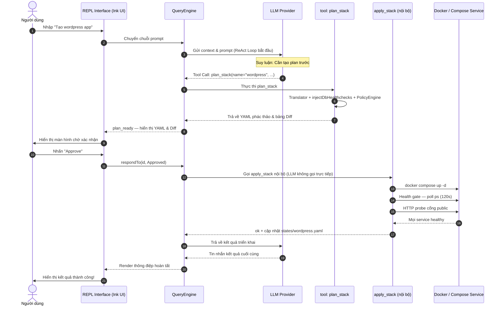

# Kiến trúc tổng thể Docker Agent CLI

Tài liệu này trình bày kiến trúc tổng thể của dự án **Docker Agent CLI** – một ứng dụng dòng lệnh thông minh tích hợp AI Agent theo mô hình **ReAct (Reasoning + Acting)** để tự động hóa và quản lý hạ tầng Docker bằng ngôn ngữ tự nhiên.

---

## 1. Sơ đồ Kiến trúc tổng quan (Architecture Overview)

Dưới đây là sơ đồ Mermaid mô tả luồng hoạt động và sự tương tác giữa các lớp (layers) trong hệ thống:

```mermaid
graph TD
    subgraph UI_Layer["Giao diện Người dùng (User Interface Layer)"]
        User["Người dùng (Terminal/Shell)"]
        CLI["CLI Entrypoint (cli.ts / commander)"]
        REPL["Interactive REPL Loop (REPL.tsx / Ink UI)"]
        Approval["Hệ thống Phê duyệt Quyền (Permissions API)"]
    end

    subgraph Agent_Core["Bộ não AI Agent (Agent Core Layer)"]
        QE["QueryEngine (Quản lý Session và Events)"]
        ReAct["ReAct Loop (query.ts)"]
        LLM["LLM Providers (Gemini, OpenAI, Ollama, OpenRouter)"]
        Prompts["Hệ thống Prompt Templates"]
    end

    subgraph Tools_Layer["Lớp Công cụ (Agent Tools Layer)"]
        direction TB
        PlanTool["plan_stack (Lập kế hoạch)"]
        ApplyTool["apply_stack (Triển khai)"]
        DestructTool["destroy_stack / destroy_all_stacks"]
        DriftTool["inspect_drift / remediate_drift"]
        PreflightTool["validate_spec / resolve_dependency / check_port_conflict"]
        ReadTool["list_stacks / get_stack_status / get_logs / get_health"]
        EscapeTool["pull_image / exec_docker"]
        PolicyTool["PolicyEngine (policies.yaml)"]
    end

    subgraph Docker_Layer["Lớp Tương tác Docker (Docker Services Layer)"]
        Compose["ComposeRunner (Chạy docker compose CLI)"]
        Engine["EngineClient (Docker Engine API)"]
        Registry["RegistryClient và ImageValidator"]
    end

    subgraph Storage_Layer["Lớp Trạng thái và Lưu trữ (State and Storage Layer)"]
        State["StateStore (states/, history.json)"]
        Session["SessionStore (sessions/)"]
        Keys["API Key Store (OS Keychain / api-keys)"]
        Secrets["Secrets Manager (secrets/.env)"]
    end
    User <-->|"Nhập lệnh và xác nhận"| REPL
    CLI -->|"Khởi tạo dependencies và REPL"| REPL
    REPL <-->|"Gửi input và nhận event"| QE
    QE <-->|"Điều phối luồng ReAct"| ReAct
    ReAct <-->|"Gửi prompt và nhận tool call"| LLM
    Prompts -.-> ReAct
    ReAct -->|"Yêu cầu gọi tool"| QE
    QE -->|"Kiểm tra quyền an toàn"| Approval
    Approval -->|"Hỏi ý kiến người dùng - Destructive Tools"| REPL
    ReAct -->|"Preflight"| PreflightTool
    ReAct -->|"Lập kế hoạch"| PlanTool
    ReAct -->|"Hủy stack"| DestructTool
    ReAct -->|"Kiểm tra drift"| DriftTool
    ReAct -->|"Đọc trạng thái"| ReadTool
    ReAct -->|"Thao tác nâng cao"| EscapeTool
    PlanTool -->|"Sau duyệt plan_ready"| ApplyTool
    PlanTool --> PolicyTool
    PlanTool --> Compose
    ApplyTool --> Compose
    DestructTool --> Compose
    DriftTool --> Compose
    ReadTool --> Compose

    DriftTool --> Engine
    ReadTool --> Engine
    EscapeTool --> Engine
    EscapeTool --> Registry
    QE <-->|"Lưu và phục hồi phiên chat"| Session
    QE <-->|"Lấy API key"| Keys

    PlanTool -.-> Secrets
    ApplyTool -.-> Secrets

    DriftTool <-->|"Kiểm tra lệch cấu hình và audit"| State
    PlanTool <-->|"Kiểm tra lệch cấu hình và audit"| State
    ApplyTool <-->|"Kiểm tra lệch cấu hình và audit"| State
```

---

## 2. Chi tiết các thành phần chính

### A. Lớp Giao diện Người dùng (User Interface Layer)
- **`cli.ts` (Entrypoint):** Điểm đầu vào phân tích các tùy chọn dòng lệnh (`--provider`, `--model`, `-y`, `--resume`).
- **`REPL.tsx`:** Xây dựng trên thư viện **Ink** (React cho terminal) mang lại trải nghiệm CLI phong phú với giao diện tương tác cao, hỗ trợ command palette, hiển thị trạng thái xử lý hàng đợi (queue) và bảng thông tin công cụ trực quan.
- **Hệ thống phê duyệt quyền:** Đảm bảo an toàn bằng cách yêu cầu người dùng xác nhận rõ ràng trước khi chạy các tác vụ phá hủy (destructive) hoặc thay đổi cấu hình hệ thống (như triển khai hoặc xóa hạ tầng).

### B. Bộ não AI Agent (Agent Core Layer)
- **`QueryEngine.ts`:** Lớp quản lý vòng đời phiên chat, trung chuyển dữ liệu giữa UI và ReAct Loop, đồng thời quản lý cơ chế phê duyệt quyền của người dùng (permissions).
- **`query.ts` (ReAct Loop):** Vận hành mô hình suy luận **ReAct (Reasoning + Acting)**:
  1. **Reason (Suy luận):** LLM phân tích yêu cầu của người dùng kết hợp với ngữ cảnh hiện tại.
  2. **Act (Hành động):** LLM quyết định gọi một công cụ (tool call) phù hợp.
  3. **Observe (Quan sát):** Hệ thống thực thi công cụ và trả kết quả về cho LLM.
  4. Lặp lại cho đến khi đạt được mục tiêu cuối cùng.
- **LLM Providers:** Hỗ trợ linh hoạt các mô hình thông qua API chính thức (Gemini 2.0 Flash, GPT-4o-mini) hoặc chạy local thông qua Ollama.

### C. Lớp Công cụ (Agent Tools Layer)
Các công cụ chuyên biệt hóa để Agent tương tác với hạ tầng. Registry gồm **14 tool** expose cho LLM (`getAgentTools()`) và **`apply_stack`** chỉ dispatch nội bộ sau khi user duyệt `plan_ready`.

- **Preflight (khuyến nghị trước `plan_stack`):** `validate_spec`, `resolve_dependency`, `check_port_conflict`.
- **Quản lý Vòng đời Stack:** `plan_stack` (sinh YAML qua translator, auto-inject healthcheck DB, qua Policy Engine), `apply_stack` *(nội bộ — health gate 120s + HTTP probe)*, `destroy_stack` / `destroy_all_stacks`.
- **Giám sát & Khắc phục:** `inspect_drift`, `remediate_drift`, `get_stack_status` (ps + log tail), `get_logs` (snapshot 16 KiB, secrets redacted), `get_health` (CPU/mem/restart/crash-loop qua Engine API).
- **Cơ chế thoát hiểm (Escape hatches):** `exec_docker` và `pull_image` cho phép chạy các lệnh Docker thuần túy khi cần thiết dưới sự giám sát an toàn.
- **Policy Engine:** Đánh giá YAML độc lập LLM — global (`~/.docker-agent/policies.yaml`) + project (`project-policies.yaml`).

### D. Lớp Tương tác Docker (Docker Services Layer)
- **`ComposeRunner`:** Đóng gói giao tiếp CLI với `docker compose` để quản lý các nhóm container phức tạp một cách nhất quán.
- **`EngineClient`:** Kết nối trực tiếp với Docker Engine API để truy xuất thông tin chi tiết về container, networks, volumes và healthchecks mà không cần phụ thuộc hoàn toàn vào compose CLI.
- **`RegistryClient` / `ImageValidator`:** Kiểm tra tính hợp lệ của Docker image trước khi triển khai để tránh lỗi thời hoặc image không tồn tại.

### E. Lớp Trạng thái & Lưu trữ (State & Storage Layer)
Duy trì trạng thái của toàn bộ hệ thống dưới thư mục ẩn cục bộ `.docker-agent/`:
- **`states/`:** Lưu trữ phiên bản Compose YAML mong muốn hiện tại cùng lịch sử (`.archive/`). Project cũ có thể còn `stacks/` — CLI tự đổi tên sang `states/` khi khởi tạo `StateStore` nếu `states/` chưa tồn tại.
- **`sessions/`:** Lưu trữ toàn bộ lịch sử tin nhắn đã redact secret (`***`) để hỗ trợ `--resume` / `/resume`.
- **`secrets/`:** Chứa tệp `.env` bảo mật theo pattern `<stack>-<service>.env` (mode `0700`).
- **`locks/`:** File lock theo stack, tránh ghi đồng thời khi apply/destroy.
- **`logs/`:** Log có cấu trúc của agent (`StructuredLogger`), không phải log container.
- **`history.json`:** Audit log (plan, apply, destroy, drift_detected, rollback, remediate).

---

## 3. Luồng dữ liệu điển hình (Triển khai Stack mới)

