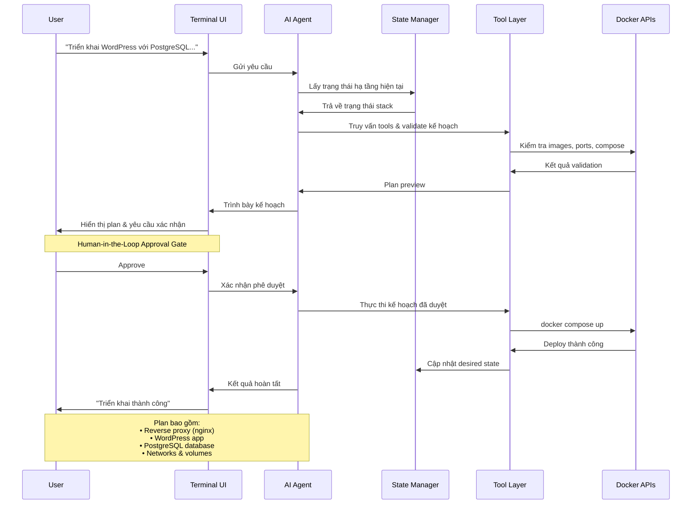
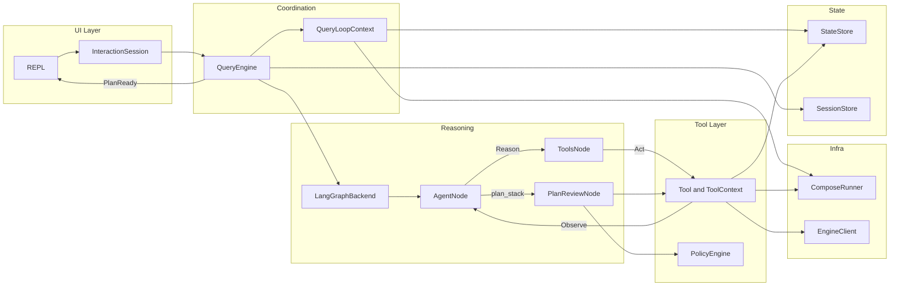

# Kiến trúc tổng thể Docker Agent CLI

Tài liệu này trình bày kiến trúc tổng thể của dự án **Docker Agent CLI** – một ứng dụng dòng lệnh thông minh tích hợp AI Agent theo mô hình **ReAct (Reasoning + Acting)** để tự động hóa và quản lý hạ tầng Docker bằng ngôn ngữ tự nhiên.

---

## 1. Sơ đồ Kiến trúc tổng quan (Architecture Overview)

Sơ đồ dưới đây mô tả kiến trúc tổng thể theo phong cách học thuật, tập trung vào các khái niệm và luồng hoạt động chính thay vì chi tiết triển khai cụ thể.

```mermaid
flowchart TD
    subgraph UI["User Interface Layer"]
        direction TB
        User["End User<br/>(Natural Language Commands)"]
        TerminalUI["Interactive Terminal Interface<br/>(REPL-style TUI with preview and confirmation dialogs)"]
    end

    subgraph Coordination["Agent Coordination Layer"]
        direction TB
        Orchestrator["Agent Orchestrator<br/>(Manages session turns, event flow, and permission enforcement)"]
        Permission["Human-in-the-Loop Approval Gate<br/>(Explicit user confirmation for destructive or high-impact operations)"]
    end

    subgraph Reasoning["Reasoning and Decision Layer"]
        direction TB
        ReAct["ReAct Reasoning Engine<br/>(Iterative Reason → Act → Observe cycle)"]
        LLM["Large Language Model Integration<br/>(Tool-calling capable models across multiple providers)"]
    end

    subgraph Tools["Tool Execution Layer"]
        direction TB
        PlanningTool["Planning Tool<br/>(Synthesizes infrastructure specification and change preview)"]
        ExecutionTool["Execution Tool<br/>(Applies approved configuration with safety checks)"]
        InspectionTools["Inspection and Remediation Tools<br/>(Status, logs, drift detection, drift remediation)"]
        PolicyEngine["Policy Validation Engine<br/>(Enforces organizational constraints on generated configurations)"]
    end

    subgraph Infra["Infrastructure Interaction Layer"]
        direction TB
        ContainerOrchestrator["Container Orchestration Adapter<br/>(Manages multi-service deployments)"]
        ContainerEngine["Container Runtime Interface<br/>(Direct access to container status, health, and logs)"]
    end

    subgraph State["State Management Layer"]
        direction TB
        DesiredState["Desired State Repository<br/>(Persisted infrastructure specifications and change history)"]
        ConversationState["Conversation and Session Persistence<br/>(Enables session resumption and audit trail)"]
    end

    %% Control Flow
    User -->|"Natural language request"| TerminalUI
    TerminalUI <-->|"User messages and system events"| Orchestrator

    Orchestrator -->|"Initiate reasoning turn"| ReAct
    ReAct <-->|"Prompts and tool calls"| LLM

    ReAct -->|"Tool invocation request"| Orchestrator
    Orchestrator -->|"Route through approval gate"| Permission
    Permission -->|"Require confirmation for destructive actions"| TerminalUI
    TerminalUI -->|"User decision"| Orchestrator
    Orchestrator -->|"Execute approved tool"| Tools

    %% Key tool flows (conceptual)
    PlanningTool -->|"Proposed configuration and diff"| Orchestrator
    Orchestrator -->|"Present plan for approval"| TerminalUI
    TerminalUI -->|"User approves plan"| Orchestrator
    Orchestrator -->|"Trigger execution (internal)"| ExecutionTool

    PlanningTool --> PolicyEngine
    InspectionTools -->|"Read current state"| ContainerOrchestrator & ContainerEngine

    ExecutionTool --> ContainerOrchestrator
    InspectionTools --> ContainerEngine
    ExecutionTool -->|"Update after successful deployment"| DesiredState

    Orchestrator <--> ConversationState
    PlanningTool & ExecutionTool & InspectionTools -->|"Record operations and state changes"| DesiredState
```



**Đặc điểm của sơ đồ (dành cho bài báo học thuật):**

- Sử dụng tên khái niệm và vai trò học thuật thay vì tên lớp hay file cụ thể trong mã nguồn.
- Làm rõ vòng lặp **ReAct** (Reason → Act → Observe) và vai trò của **Human-in-the-Loop Approval**.
- Phân biệt rõ ràng giữa giai đoạn lập kế hoạch và giai đoạn thực thi.
- Giữ mức chi tiết phù hợp để đưa trực tiếp vào hình minh họa của bài báo.


---

## 2. Chi tiết các thành phần chính

### A. User Interface Layer (Giao diện người dùng)
- Điểm vào: `cli.py` khởi tạo REPL (`screens/repl.py`) với Textual TUI.
- `ActivityTimeline` hiển thị luồng hội thoại, tool calls, và tiến trình theo thời gian thực.
- Dialogs chuyên biệt: `plan_preview.py` (plan approval), `permission_dialog.py`, `typed_confirm_dialog.py`, `secrets_input_dialog.py`.
- **Human-in-the-Loop Approval Gate** chặn mọi thao tác destructive cho đến khi user xác nhận trong UI — kể cả khi dùng flag `--yes`.

### B. Agent Coordination and Reasoning Layer (Lớp điều phối và suy luận)
- **Agent Orchestrator** (`QueryEngine` + `InteractionSession`) quản lý vòng đời phiên, hàng đợi turn, luồng sự kiện, và các future phê duyệt (`request_confirm`, `request_permission`, `request_typed_confirm`).
- **ReAct Engine** mặc định dùng `LangGraphBackend` — đồ thị `agent → tools | plan_review | remediate_drift → agent`. Backend thay thế `CurrentBackend` khi đặt `DOCKER_AGENT_BACKEND=current`.
- Chu trình lặp: **Suy luận (Reason)** → **Hành động (Act)** → **Quan sát (Observe)** cho đến khi hoàn thành mục tiêu hoặc đạt `MAX_ITERATIONS`.
- **LLM Integration** qua `services/api/providers/` (OpenAI, Gemini, Ollama, OpenRouter) với tool-calling thống nhất.

### C. Tool Execution Layer (Lớp thực thi công cụ)
Lớp này cung cấp 17 công cụ trong `tools/`. LLM gọi trực tiếp hầu hết tool; `apply_stack` **không** exposed cho LLM — chỉ được kích hoạt nội bộ sau khi user phê duyệt plan.

| Nhóm | Tool | Ghi chú |
| :--- | :--- | :--- |
| Preflight | `validate_spec`, `resolve_dependency`, `check_port_conflict` | Read-only; agent gọi trước `plan_stack` |
| Planning | `plan_stack` | Sinh Compose YAML + diff; route qua node `plan_review` |
| Execution | `apply_stack` | Nội bộ; gọi từ `plan_review_node` / `apply_with_rollback` |
| Lifecycle | `destroy_stack`, `destroy_all_stacks` | Yêu cầu typed confirm hoặc permission gate |
| Inspection | `list_stacks`, `get_stack_status`, `get_logs`, `get_health`, `inspect_drift` | Read-only |
| Remediation | `remediate_drift` | Route qua node `remediate_drift`; apply sau khi duyệt |
| Escape-hatch | `exec_docker`, `pull_image`, `remove_container` | Whitelist / permission controlled |
| Policy | `PolicyEngine` | Đánh giá YAML trong `plan_review_node` và `remediate_drift_node` |

### D. Infrastructure Interaction Layer (Lớp tương tác hạ tầng)
- **Container Orchestration Adapter** (`ComposeRunner`): triển khai multi-service qua `docker compose up/down`, health verification với timeout.
- **Container Runtime Interface** (`engine_client`): truy vấn trạng thái container, stats, health và logs trực tiếp từ Docker Engine API.

### E. State & Persistence Layer (Lớp trạng thái và lưu trữ)
Hệ thống duy trì hai loại trạng thái chính qua `StateStore` và `SessionStore`:

| Thành phần | Đường dẫn | Vai trò |
| :--- | :--- | :--- |
| Desired State | `docker-stacks/<name>.yaml` | Đặc tả stack đã phê duyệt (`x-docker-agent` metadata) |
| Session | `.docker-agent/sessions/<id>.json` | Transcript hội thoại (secrets đã redact), hỗ trợ `--resume` |
| Secrets | `.docker-agent/secrets/` | Env files tự sinh, mode `0o600` |
| History | `.docker-agent/` (archive, locks, logs) | Lịch sử thay đổi, rollback, audit trail |

---

## 3. Luồng hoạt động điển hình (Triển khai Stack mới)

Sơ đồ dưới đây mô tả tương tác ở mức **layer** — đủ 6 thành phần chính, không đi sâu vào từng tool call.



**Điểm kiến trúc quan trọng (xác minh qua codegraph):**

- `apply_stack` không được LLM gọi — framework kích hoạt nội bộ trong `plan_review_node` sau khi user approve.
- Preflight (`validate_spec`, `resolve_dependency`, `check_port_conflict`) và policy check nằm trong Tool Layer, chạy trước khi user thấy plan preview.
- Approval Gate tách biệt: `QueryEngine` phát sự kiện `PlanReady`, `InteractionSession` chuyển phase sang `awaiting_input`, Terminal UI hiển thị dialog.

---

## 4. Ánh xạ Layer → Triển khai

| Layer (khái niệm) | Module chính | Vai trò |
| :--- | :--- | :--- |
| Terminal UI | `screens/repl.py`, `components/plan_preview.py`, `components/permission_dialog.py` | REPL, plan preview, approval dialogs |
| Agent Orchestrator | `query_engine.py`, `screens/use_interaction_session.py` | Session turns, event queue, permission futures |
| ReAct Engine | `engine/graph.py`, `engine/langgraph_backend.py` | LangGraph: `agent → tools \| plan_review \| remediate_drift` |
| LLM Integration | `services/api/providers/`, `engine/nodes/agent_node.py` | Provider-driven tool calling |
| Tool Layer | `tools/`, `engine/nodes/tools_node.py`, `engine/nodes/plan_review_node.py` | 17 tools + special nodes cho plan/apply |
| Policy Engine | `policy/policy_engine.py` | Đánh giá `project-policies.yaml` / global policy |
| State Manager | `state/state_store.py`, `state/session_store.py` | `docker-stacks/`, `.docker-agent/sessions/` |
| Docker APIs | `services/docker/compose_runner.py`, `services/docker/engine_client.py` | Compose orchestration + Engine API |

---

## 5. Sơ đồ Class Diagram theo Layer

Phần này ánh xạ các **class kiến trúc** (không liệt kê toàn bộ DTO/input schema) theo 6 layer ở mục 1, và làm rõ **phụ thuộc giữa các layer**. Cấu trúc được xác minh qua phân tích mã nguồn (`import`, composition, protocol implementation).

### 5.1. Class Diagram tổng thể

Sơ đồ dùng `namespace` để nhóm class theo 6 layer (khung package). Nhãn namespace: `UI_Layer`, `Coordination_Layer`, `Reasoning_Layer`, `Tool_Layer`, `Infra_Layer`, `State_Layer`. Màu nền: xanh dương = UI, tím = Coordination, xanh lá = Reasoning, cam = Tool, hồng = Infra, xám = State.

```mermaid
classDiagram
    classDef uiLayer fill:#e3f2fd,stroke:#1565c0,color:#0d47a1
    classDef coordLayer fill:#f3e5f5,stroke:#7b1fa2,color:#4a148c
    classDef reasonLayer fill:#e8f5e9,stroke:#2e7d32,color:#1b5e20
    classDef toolLayer fill:#fff3e0,stroke:#ef6c00,color:#e65100
    classDef infraLayer fill:#fce4ec,stroke:#c62828,color:#b71c1c
    classDef stateLayer fill:#eceff1,stroke:#455a64,color:#263238

    namespace UI_Layer {
        class REPL
        class InteractionSession
        class ActivityTimeline
        class PermissionDialog
        class TypedConfirmDialog
        class SecretsInputDialog
    }

    namespace Coordination_Layer {
        class QueryEngine
        class QueryLoopContext
    }

    namespace Reasoning_Layer {
        class AgentBackend {
            <<interface>>
        }
        class LangGraphBackend
        class CurrentBackend
        class GraphDeps
        class BuildGraph
        class AgentState
        class AgentNode
        class ToolsNode
        class PlanReviewNode
        class RemediateDriftNode
        class Provider {
            <<interface>>
        }
        class OpenAIProvider
        class GeminiProvider
        class OllamaProvider
        class OpenRouterProvider
    }

    namespace Tool_Layer {
        class Tool {
            <<interface>>
        }
        class ToolContext
        class ToolRun
        class RunTool
        class PolicyEngine
        class PolicyConfig
        class PlanStack
        class ApplyStack
        class RunApplyWithRollback
        class PreflightTools
        class InspectionTools
        class LifecycleTools
    }

    namespace Infra_Layer {
        class ComposeRunner
        class BoundComposeRunner
        class Spawner {
            <<interface>>
        }
        class DefaultSpawner
        class EngineClient {
            <<interface>>
        }
        class ImageValidator
        class RegistryClient
    }

    namespace State_Layer {
        class StateStore
        class SessionStore
        class StructuredLogger
        class HistoryEvent
    }

    class REPL:::uiLayer
    class InteractionSession:::uiLayer
    class ActivityTimeline:::uiLayer
    class PermissionDialog:::uiLayer
    class TypedConfirmDialog:::uiLayer
    class SecretsInputDialog:::uiLayer
    class QueryEngine:::coordLayer
    class QueryLoopContext:::coordLayer
    class AgentBackend:::reasonLayer
    class LangGraphBackend:::reasonLayer
    class CurrentBackend:::reasonLayer
    class GraphDeps:::reasonLayer
    class BuildGraph:::reasonLayer
    class AgentState:::reasonLayer
    class AgentNode:::reasonLayer
    class ToolsNode:::reasonLayer
    class PlanReviewNode:::reasonLayer
    class RemediateDriftNode:::reasonLayer
    class Provider:::reasonLayer
    class OpenAIProvider:::reasonLayer
    class GeminiProvider:::reasonLayer
    class OllamaProvider:::reasonLayer
    class OpenRouterProvider:::reasonLayer
    class Tool:::toolLayer
    class ToolContext:::toolLayer
    class ToolRun:::toolLayer
    class RunTool:::toolLayer
    class PolicyEngine:::toolLayer
    class PolicyConfig:::toolLayer
    class PlanStack:::toolLayer
    class ApplyStack:::toolLayer
    class RunApplyWithRollback:::toolLayer
    class PreflightTools:::toolLayer
    class InspectionTools:::toolLayer
    class LifecycleTools:::toolLayer
    class ComposeRunner:::infraLayer
    class BoundComposeRunner:::infraLayer
    class Spawner:::infraLayer
    class DefaultSpawner:::infraLayer
    class EngineClient:::infraLayer
    class ImageValidator:::infraLayer
    class RegistryClient:::infraLayer
    class StateStore:::stateLayer
    class SessionStore:::stateLayer
    class StructuredLogger:::stateLayer
    class HistoryEvent:::stateLayer

    REPL --> InteractionSession
    REPL --> ActivityTimeline
    REPL --> PermissionDialog
    REPL --> TypedConfirmDialog
    REPL --> SecretsInputDialog
    InteractionSession --> QueryEngine

    QueryEngine --> AgentBackend
    QueryEngine --> StateStore
    QueryEngine --> SessionStore
    QueryEngine --> ComposeRunner
    QueryEngine --> Provider
    QueryEngine ..> QueryLoopContext
    QueryEngine --> StructuredLogger

    LangGraphBackend ..|> AgentBackend
    CurrentBackend ..|> AgentBackend
    LangGraphBackend --> GraphDeps
    LangGraphBackend --> PolicyEngine
    GraphDeps --> BuildGraph
    BuildGraph --> AgentNode
    BuildGraph --> ToolsNode
    BuildGraph --> PlanReviewNode
    BuildGraph --> RemediateDriftNode
    AgentNode --> Provider
    AgentNode --> AgentState
    ToolsNode --> AgentState
    PlanReviewNode --> AgentState
    RemediateDriftNode --> AgentState
    OpenAIProvider ..|> Provider
    GeminiProvider ..|> Provider
    OllamaProvider ..|> Provider
    OpenRouterProvider ..|> Provider

    ToolsNode --> RunTool
    PlanReviewNode --> PlanStack
    PlanReviewNode --> RunApplyWithRollback
    RemediateDriftNode --> RunApplyWithRollback
    RunTool --> Tool
    RunApplyWithRollback --> ApplyStack
    Tool --> ToolContext
    PlanReviewNode --> PolicyEngine
    RemediateDriftNode --> PolicyEngine
    PolicyEngine --> PolicyConfig
    PreflightTools ..|> Tool
    InspectionTools ..|> Tool
    LifecycleTools ..|> Tool
    PlanStack ..|> Tool
    ApplyStack ..|> Tool

    ToolContext --> StateStore
    ToolContext --> ComposeRunner
    ToolContext --> EngineClient
    ApplyStack --> ComposeRunner
    ApplyStack --> StateStore
    InspectionTools --> ComposeRunner
    InspectionTools --> EngineClient
    ComposeRunner --> BoundComposeRunner
    ComposeRunner --> Spawner
    DefaultSpawner ..|> Spawner
    ImageValidator --> RegistryClient
    StateStore --> HistoryEvent
```



> **Ánh xạ tên trong sơ đồ → mã nguồn:** `QueryLoopContext` = `_QueryLoopContext`, `BuildGraph` = `build_graph()`, `AgentNode` = `agent_node`, `RunTool` = `run_tool()`, `PlanStack` = `plan_stack`, `ApplyStack` = `apply_stack`, `RunApplyWithRollback` = `run_apply_with_rollback()`.

### 5.2. Quy tắc phụ thuộc giữa các Layer

Sơ đồ trên tuân theo **dependency rule một chiều**: layer trên chỉ phụ thuộc layer dưới, không có phụ thuộc ngược về UI.

| Từ Layer | Đến Layer | Kiểu phụ thuộc | Class / điểm nối chính |
| :--- | :--- | :--- | :--- |
| **UI** | **Coordination** | Composition | `REPL` → `InteractionSession` → `QueryEngine` |
| **UI** | **Coordination** | Event callback | Dialogs (`PermissionDialog`, `TypedConfirmDialog`, `SecretsInputDialog`) gọi `InteractionSession.respond()` |
| **Coordination** | **Reasoning** | Factory + async stream | `QueryEngine` gọi `create_backend()` → `LangGraphBackend.query()` |
| **Coordination** | **State** | Composition | `QueryEngine` giữ `StateStore`, `SessionStore`, `StructuredLogger` |
| **Coordination** | **Infra** | Composition | `QueryEngine` inject `ComposeRunner`, `docker_engine` vào `QueryLoopContext` |
| **Reasoning** | **Tool** | Graph node dispatch | `tools_node`, `plan_review_node`, `remediate_drift_node` gọi `run_tool()` / `run_apply_with_rollback()` |
| **Reasoning** | **LLM (trong Reasoning)** | Protocol | `agent_node` → `Provider` (OpenAI, Gemini, Ollama, OpenRouter) |
| **Tool** | **Infra** | Context injection | `ToolContext.compose_runner`, `ToolContext.docker_engine` |
| **Tool** | **State** | Read/write | `ToolContext.state_store`; `apply_stack` ghi desired state + history |
| **Tool** | **Policy (trong Tool)** | Evaluation | `plan_review_node`, `remediate_drift_node` → `PolicyEngine.evaluate()` |
| **Infra** | *(không có)* | — | `ComposeRunner`, `EngineClient` là leaf — chỉ gọi Docker CLI/API |
| **State** | *(không có)* | — | `StateStore`, `SessionStore` chỉ đọc/ghi filesystem |

**Ràng buộc kiến trúc quan trọng:**

1. **`apply_stack` không exposed cho LLM** — chỉ `get_all_tools()` (nội bộ) chứa nó; LLM chỉ thấy `get_agent_tools()` (16 tool). `plan_review_node` và `remediate_drift_node` kích hoạt `run_apply_with_rollback()` → `apply_stack` sau khi user approve.
2. **`QueryLoopContext` (`_QueryLoopContext`) là cầu nối** — `QueryEngine` đóng gói permission futures (`request_confirm`, `request_permission`, `request_typed_confirm`, `request_secrets_input`) thành `ctx` truyền xuống toàn bộ Reasoning và Tool Layer.
3. **`ToolContext` tái sử dụng dependency** — mọi tool nhận cùng bundle (`StateStore` + `ComposeRunner` + `docker_engine`), đảm bảo Tool Layer không tự khởi tạo hạ tầng.
4. **Approval Gate nằm giữa Coordination và UI** — `QueryEngine` phát `PlanReady` / `PermissionRequest`; `InteractionSession` chuyển phase sang `awaiting_input`; `REPL` hiển thị dialog tương ứng rồi gọi `respond()`.

### 5.3. Luồng phụ thuộc theo vòng ReAct



Vòng **Reason → Act → Observe** diễn ra hoàn toàn trong Reasoning + Tool Layer; Coordination chỉ điều phối turn và chặn tại approval gate; UI chỉ render event stream và thu thập quyết định người dùng.

---

## 6. Giải thích cấu trúc thư mục và các tệp tin (Directory Structure & Components)

Dưới đây là sơ đồ cấu trúc thư mục tổng quát và vai trò chi tiết của từng thư mục, tệp tin quan trọng trong dự án **Docker Agent CLI**.

### 6.1. Tổng quan cấu trúc cây thư mục (Directory Tree)

```text
Docker-Agent-CLI/
├── .agents/                  # Các cấu hình và kịch bản hỗ trợ phát triển tác nhân (Agent)
├── docker-stacks/            # Thư mục chứa trạng thái mong muốn (Desired State) dưới dạng YAML
├── docs/                     # Tài liệu hướng dẫn sử dụng và đặc tả chức năng
├── tests/                    # Mã nguồn kiểm thử (Unit test và Integration test)
├── src/                      # Thư mục mã nguồn chính của ứng dụng
│   └── docker_agent/
│       ├── cli.py            # Điểm đầu vào chính (CLI Entrypoint) của ứng dụng
│       ├── query_engine.py   # Bộ điều phối chính (Orchestrator), xử lý sự kiện và vòng đời phiên
│       ├── components/       # Các thành phần giao diện người dùng Textual (widgets, dialogs)
│       ├── screens/          # Các màn hình TUI lớn (REPL Chat, Status, Settings)
│       ├── engine/           # Bộ não lập luận và quản lý luồng đồ thị tác nhân (LangGraph)
│       │   ├── graph.py      # Xây dựng và định nghĩa đồ thị luồng công việc
│       │   └── nodes/        # Các nút xử lý logic trong đồ thị (Agent, Tools, Plan Review, Rollback)
│       ├── policy/           # Công cụ thực thi chính sách bảo mật (Policy Engine) cho Docker Compose
│       ├── services/         # Dịch vụ giao tiếp với hệ thống bên ngoài
│       │   ├── docker/       # Tương tác trực tiếp Docker Engine & Compose Runner
│       │   └── api/          # Tương tác với các dịch vụ mô hình ngôn ngữ lớn (LLM API)
│       ├── state/            # Quản lý lưu trữ trạng thái phiên và cấu hình hạ tầng
│       └── tools/            # Tập hợp 17 công cụ (Tools) chuyên biệt được Agent gọi
└── pyproject.toml            # Định nghĩa metadata của dự án và các thư viện phụ thuộc (dependencies)
```

### 6.2. Chi tiết tác dụng của từng Folder và File chính

#### A. Thư mục gốc dự án (Workspace Root)
*   **[docker-stacks/](file:///d:/AI/Docker-Agent-CLI/docker-stacks/)**: Lưu trữ các file cấu hình Docker Compose YAML hoàn chỉnh của từng stack được triển khai. Đây là cơ sở dữ liệu về **Desired State (Trạng thái mong muốn)** của hệ thống. Mỗi file YAML ở đây chứa metadata `x-docker-agent` để theo dõi các thông số triển khai.
*   **[tests/](file:///d:/AI/Docker-Agent-CLI/tests/)**: Chứa toàn bộ các bài kiểm thử tự động, bao gồm kiểm thử đơn vị (unit tests) cho các tool, engine, policy và kiểm thử tích hợp (integration tests) giao tiếp trực tiếp với Docker Engine.
*   **[pyproject.toml](file:///d:/AI/Docker-Agent-CLI/pyproject.toml)** & **[uv.lock](file:///d:/AI/Docker-Agent-CLI/uv.lock)**: File cấu hình quản lý môi trường ảo, đóng gói ứng dụng bằng công cụ `uv` và khai báo chi tiết các thư viện phụ thuộc (như `textual`, `langgraph`, `docker`, `pydantic`, v.v.).
*   **[architecture.md](file:///d:/AI/Docker-Agent-CLI/architecture.md)**: File tài liệu thiết kế kiến trúc hệ thống hiện tại.

#### B. Thư mục mã nguồn [src/docker_agent/](file:///d:/AI/Docker-Agent-CLI/src/docker_agent/)
Đây là nơi chứa toàn bộ logic xử lý chính của ứng dụng.

##### 1. Tệp tin khởi chạy và điều phối
*   **[cli.py](file:///d:/AI/Docker-Agent-CLI/src/docker_agent/cli.py)**: Đóng vai trò là CLI Entrypoint. Nó phân tích các đối số dòng lệnh (command-line arguments), cấu hình môi trường và khởi chạy ứng dụng Textual REPL.
*   **[query_engine.py](file:///d:/AI/Docker-Agent-CLI/src/docker_agent/query_engine.py)**: Chứa lớp `QueryEngine` điều phối luồng xử lý truy vấn từ người dùng. Nó quản lý trạng thái phiên, gọi các Agent Backend (`LangGraphBackend`), xử lý lỗi, và gửi/nhận phản hồi thông qua các cổng phê duyệt (Approval Gate).

##### 2. Thư mục UI: [components/](file:///d:/AI/Docker-Agent-CLI/src/docker_agent/components/) & [screens/](file:///d:/AI/Docker-Agent-CLI/src/docker_agent/screens/)
Xây dựng giao diện dòng lệnh đồ họa (TUI) bằng thư viện **Textual**:
*   `screens/repl.py`: Giao diện trò chuyện chính (REPL Chat Screen), nơi người dùng nhập lệnh tự nhiên và xem luồng suy nghĩ của Agent.
*   `components/plan_preview.py`: Hộp thoại hiển thị bản xem trước kế hoạch (Compose YAML và sự thay đổi - Diff) để người dùng xem xét kỹ lưỡng trước khi triển khai.
*   `components/permission_dialog.py` & `components/typed_confirm.py`: Các hộp thoại xác nhận quyền hoặc yêu cầu người dùng gõ xác nhận đối với các thao tác hủy hoại (destructive) như xóa stack.

##### 3. Thư mục [engine/](file:///d:/AI/Docker-Agent-CLI/src/docker_agent/engine/) (Lớp suy luận ReAct)
*   `graph.py` & `langgraph_backend.py`: Định nghĩa cấu trúc đồ thị trạng thái (State Graph) thông qua LangGraph, thiết lập các luồng chuyển tiếp giữa các nút (Nodes) dựa trên trạng thái hiện tại.
*   **[nodes/](file:///d:/AI/Docker-Agent-CLI/src/docker_agent/engine/nodes/)**:
    *   `agent_node.py`: Gửi prompt và lịch sử hội thoại đến LLM để nhận về quyết định tiếp theo (suy luận hoặc gọi tool).
    *   `tools_node.py`: Thực thi các công cụ kỹ thuật mà LLM yêu cầu và trả về kết quả quan sát (Observe).
    *   `plan_review_node.py`: Nút trung gian thực hiện kiểm tra chính sách (Policy Engine) và hiển thị hộp thoại duyệt kế hoạch trước khi áp dụng thực tế.
    *   `apply_with_rollback.py`: Tiến hành triển khai và giám sát tiến trình khởi chạy; nếu phát hiện lỗi hoặc không đạt trạng thái Healthy, nó sẽ tự động kích hoạt tiến trình Rollback để đưa hệ thống về trạng thái an toàn trước đó.

##### 4. Thư mục [policy/](file:///d:/AI/Docker-Agent-CLI/src/docker_agent/policy/) (Đảm bảo an toàn hệ thống)
*   `policy_engine.py`: Chứa lớp `PolicyEngine` đọc file quy tắc cấu hình (`project-policies.yaml`). Lớp này phân tích cú pháp Docker Compose YAML sinh ra bởi LLM để phát hiện các mối nguy hại tiềm ẩn (ví dụ: mở cổng nhạy cảm, mount các thư mục hệ thống nguy hiểm, chạy container dưới quyền root, v.v.).

##### 5. Thư mục [services/](file:///d:/AI/Docker-Agent-CLI/src/docker_agent/services/) (Lớp trừu tượng hạ tầng)
*   **[docker/](file:///d:/AI/Docker-Agent-CLI/src/docker_agent/services/docker/)**:
    *   `compose_runner.py`: Trình thực thi trực tiếp lệnh `docker compose` qua tiến trình con, quản lý các tham số như `up`, `down`, `logs`, và kiểm tra trạng thái sức khỏe (health checks).
    *   `engine_client.py`: Sử dụng thư viện Docker Python SDK hoặc Docker Engine API trực tiếp để kiểm tra tài nguyên hệ thống (containers, ports, volumes, images).
    *   `image_validator.py` & `registry_client.py`: Giao tiếp với Docker Hub Registry để xác thực sự tồn tại của image và tag trước khi tải về.
*   **[api/](file:///d:/AI/Docker-Agent-CLI/src/docker_agent/services/api/)**:
    *   `providers/`: Chứa các driver tích hợp cho từng nhà cung cấp mô hình ngôn ngữ khác nhau (`openai.py`, `gemini.py`, `ollama.py`, `openrouter.py`), chuẩn hóa đầu vào và cấu trúc Tool-calling.

##### 6. Thư mục [state/](file:///d:/AI/Docker-Agent-CLI/src/docker_agent/state/) (Quản lý trạng thái và Nhật ký)
*   `state_store.py`: Đọc/ghi các cấu hình YAML mong muốn trong thư mục `docker-stacks/`.
*   `session_store.py`: Ghi lại nhật ký hội thoại đầy đủ của phiên hiện tại, hỗ trợ khôi phục phiên (`--resume`) khi khởi động lại CLI.
*   `drift_detector.py`: So sánh trạng thái thực tế của các container đang chạy trong Docker Engine với đặc tả mong muốn trong Desired State để phát hiện các thay đổi ngoài ý muốn (drift).

##### 7. Thư mục [tools/](file:///d:/AI/Docker-Agent-CLI/src/docker_agent/tools/) (Các công cụ thực thi)
Chứa 17 công cụ độc lập thực hiện các nhiệm vụ chuyên biệt:
*   `plan_stack.py`: Sinh file compose YAML dựa trên yêu cầu của người dùng.
*   `apply_stack.py`: Ghi file compose YAML đã duyệt vào Desired State và gọi trình thực thi triển khai.
*   `check_port_conflict.py`: Quét cổng hệ thống để ngăn chặn xung đột trước khi khởi chạy.
*   `inspect_drift.py` & `remediate_drift.py`: Phát hiện và tự động sửa chữa độ lệch cấu hình.
*   `get_logs.py` / `get_health.py` / `get_stack_status.py`: Các công cụ giám sát, thu thập thông tin thời gian thực.
*   `destroy_stack.py` / `destroy_all_stacks.py`: Hủy bỏ các dịch vụ và dọn dẹp tài nguyên Docker liên quan.
