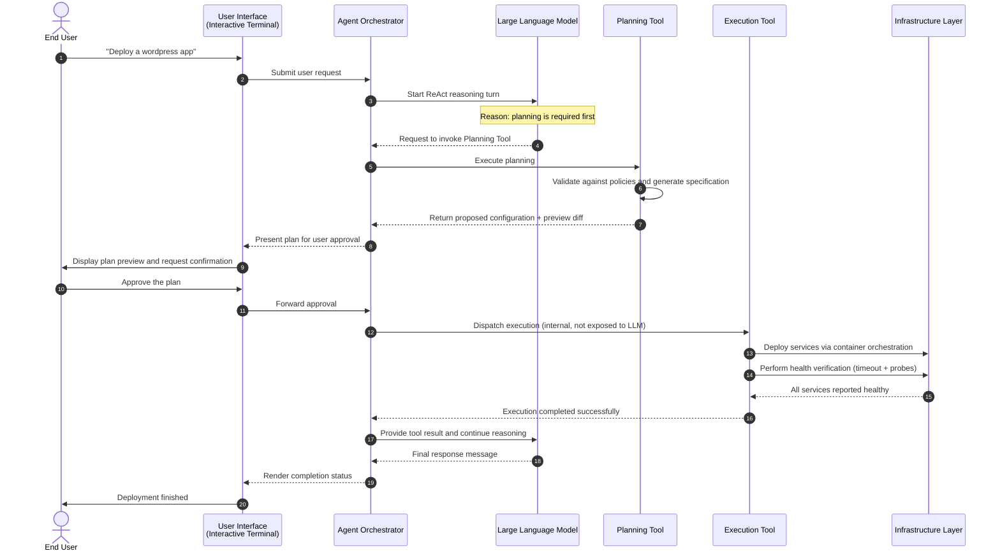

# Kiến trúc tổng thể Docker Agent CLI

Tài liệu này trình bày kiến trúc tổng thể của dự án **Docker Agent CLI** – một ứng dụng dòng lệnh thông minh tích hợp AI Agent theo mô hình **ReAct (Reasoning + Acting)** để tự động hóa và quản lý hạ tầng Docker bằng ngôn ngữ tự nhiên.

---

## 1. Sơ đồ Kiến trúc tổng quan (Architecture Overview)

Sơ đồ dưới đây mô tả kiến trúc tổng thể theo phong cách học thuật, tập trung vào các khái niệm và luồng hoạt động chính thay vì chi tiết triển khai cụ thể.

```mermaid
flowchart TD
    subgraph UI["User Interface Layer"]
        direction TB
        User["End User<br/>(Natural Language Commands)"]
        TerminalUI["Interactive Terminal Interface<br/>(REPL-style TUI with preview and confirmation dialogs)"]
    end

    subgraph Coordination["Agent Coordination Layer"]
        direction TB
        Orchestrator["Agent Orchestrator<br/>(Manages session turns, event flow, and permission enforcement)"]
        Permission["Human-in-the-Loop Approval Gate<br/>(Explicit user confirmation for destructive or high-impact operations)"]
    end

    subgraph Reasoning["Reasoning and Decision Layer"]
        direction TB
        ReAct["ReAct Reasoning Engine<br/>(Iterative Reason → Act → Observe cycle)"]
        LLM["Large Language Model Integration<br/>(Tool-calling capable models across multiple providers)"]
    end

    subgraph Tools["Tool Execution Layer"]
        direction TB
        PlanningTool["Planning Tool<br/>(Synthesizes infrastructure specification and change preview)"]
        ExecutionTool["Execution Tool<br/>(Applies approved configuration with safety checks)"]
        InspectionTools["Inspection and Remediation Tools<br/>(Status, logs, drift detection, drift remediation)"]
        PolicyEngine["Policy Validation Engine<br/>(Enforces organizational constraints on generated configurations)"]
    end

    subgraph Infra["Infrastructure Interaction Layer"]
        direction TB
        ContainerOrchestrator["Container Orchestration Adapter<br/>(Manages multi-service deployments)"]
        ContainerEngine["Container Runtime Interface<br/>(Direct access to container status, health, and logs)"]
    end

    subgraph State["State Management Layer"]
        direction TB
        DesiredState["Desired State Repository<br/>(Persisted infrastructure specifications and change history)"]
        ConversationState["Conversation and Session Persistence<br/>(Enables session resumption and audit trail)"]
    end

    %% Control Flow
    User -->|"Natural language request"| TerminalUI
    TerminalUI <-->|"User messages and system events"| Orchestrator

    Orchestrator -->|"Initiate reasoning turn"| ReAct
    ReAct <-->|"Prompts and tool calls"| LLM

    ReAct -->|"Tool invocation request"| Orchestrator
    Orchestrator -->|"Route through approval gate"| Permission
    Permission -->|"Require confirmation for destructive actions"| TerminalUI
    TerminalUI -->|"User decision"| Orchestrator
    Orchestrator -->|"Execute approved tool"| Tools

    %% Key tool flows (conceptual)
    PlanningTool -->|"Proposed configuration and diff"| Orchestrator
    Orchestrator -->|"Present plan for approval"| TerminalUI
    TerminalUI -->|"User approves plan"| Orchestrator
    Orchestrator -->|"Trigger execution (internal)"| ExecutionTool

    PlanningTool --> PolicyEngine
    InspectionTools -->|"Read current state"| ContainerOrchestrator & ContainerEngine

    ExecutionTool --> ContainerOrchestrator
    InspectionTools --> ContainerEngine
    ExecutionTool -->|"Update after successful deployment"| DesiredState

    Orchestrator <--> ConversationState
    PlanningTool & ExecutionTool & InspectionTools -->|"Record operations and state changes"| DesiredState
```

**Đặc điểm của sơ đồ (dành cho bài báo học thuật):**

- Sử dụng tên khái niệm và vai trò học thuật thay vì tên lớp hay file cụ thể trong mã nguồn.
- Làm rõ vòng lặp **ReAct** (Reason → Act → Observe) và vai trò của **Human-in-the-Loop Approval**.
- Phân biệt rõ ràng giữa giai đoạn lập kế hoạch và giai đoạn thực thi.
- Giữ mức chi tiết phù hợp để đưa trực tiếp vào hình minh họa của bài báo.

---

## 2. Chi tiết các thành phần chính

### A. User Interface Layer (Giao diện người dùng)
- Điểm vào dòng lệnh tiếp nhận tham số cấu hình và khởi tạo giao diện tương tác.
- Giao diện terminal tương tác hỗ trợ hiển thị kế hoạch, hộp thoại xác nhận, bảng lệnh nhanh và theo dõi tiến trình.
- Cơ chế phê duyệt bắt buộc đối với các thao tác phá hủy hoặc có tác động lớn đến hạ tầng.

### B. Agent Coordination and Reasoning Layer (Lớp điều phối và suy luận)
- Thành phần điều phối quản lý vòng đời phiên làm việc, điều phối luồng sự kiện và thực thi chính sách phê duyệt.
- Động cơ suy luận ReAct thực hiện chu trình lặp: **Suy luận (Reason)** → **Hành động (Act)** → **Quan sát (Observe)** cho đến khi hoàn thành mục tiêu.
- Tích hợp với nhiều nhà cung cấp mô hình ngôn ngữ lớn thông qua giao diện thống nhất hỗ trợ gọi công cụ (tool calling).

### C. Tool Execution Layer (Lớp thực thi công cụ)
Lớp này cung cấp các công cụ chuyên biệt cho tác tử tương tác với hạ tầng. Một số công cụ được mô hình ngôn ngữ gọi trực tiếp, trong khi công cụ triển khai chỉ được kích hoạt nội bộ sau khi người dùng phê duyệt kế hoạch.

- Công cụ tiền kiểm tra (preflight): xác thực đặc tả, giải quyết phụ thuộc, kiểm tra xung đột cổng.
- Công cụ quản lý vòng đời: công cụ lập kế hoạch (sinh cấu hình và bản xem trước thay đổi), công cụ thực thi (áp dụng sau khi duyệt), công cụ hủy.
- Công cụ giám sát và khắc phục: kiểm tra lệch cấu hình (drift), khắc phục lệch, truy vấn trạng thái, nhật ký và tình trạng sức khỏe.
- Công cụ chính sách: đánh giá cấu hình theo quy tắc tổ chức trước khi triển khai.
- Công cụ dự phòng: cho phép thực thi một số lệnh hạ tầng trực tiếp dưới sự kiểm soát an toàn.

### D. Infrastructure Interaction Layer (Lớp tương tác hạ tầng)
- Bộ điều hợp điều phối container: chịu trách nhiệm triển khai và quản lý các nhóm dịch vụ phức tạp.
- Giao diện thời gian chạy container: truy vấn trực tiếp trạng thái, thống kê tài nguyên, kiểm tra sức khỏe và nhật ký từ engine.

### E. State & Persistence Layer (Lớp trạng thái và lưu trữ)
Hệ thống duy trì hai loại trạng thái chính:
- Trạng thái mong muốn của hạ tầng (các đặc tả cấu hình đã được phê duyệt) cùng lịch sử thay đổi.
- Lịch sử phiên hội thoại (đã loại bỏ thông tin nhạy cảm) nhằm hỗ trợ tiếp tục phiên làm việc và tạo dấu vết kiểm toán.
- Ngoài ra, hệ thống quản lý thông tin xác thực và bí mật theo cách riêng biệt với các hạn chế truy cập phù hợp.

---

## 3. Luồng dữ liệu điển hình (Triển khai Stack mới)

