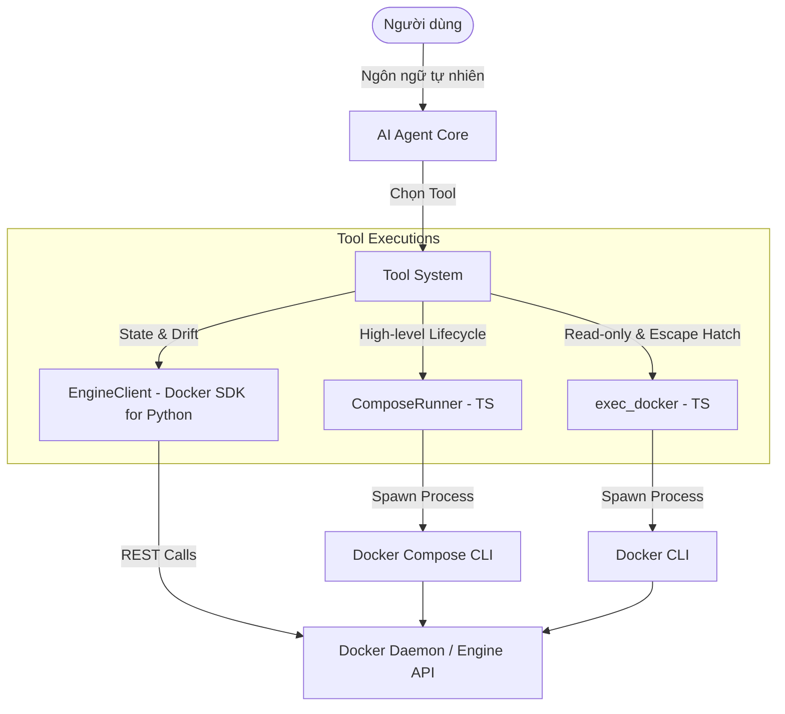
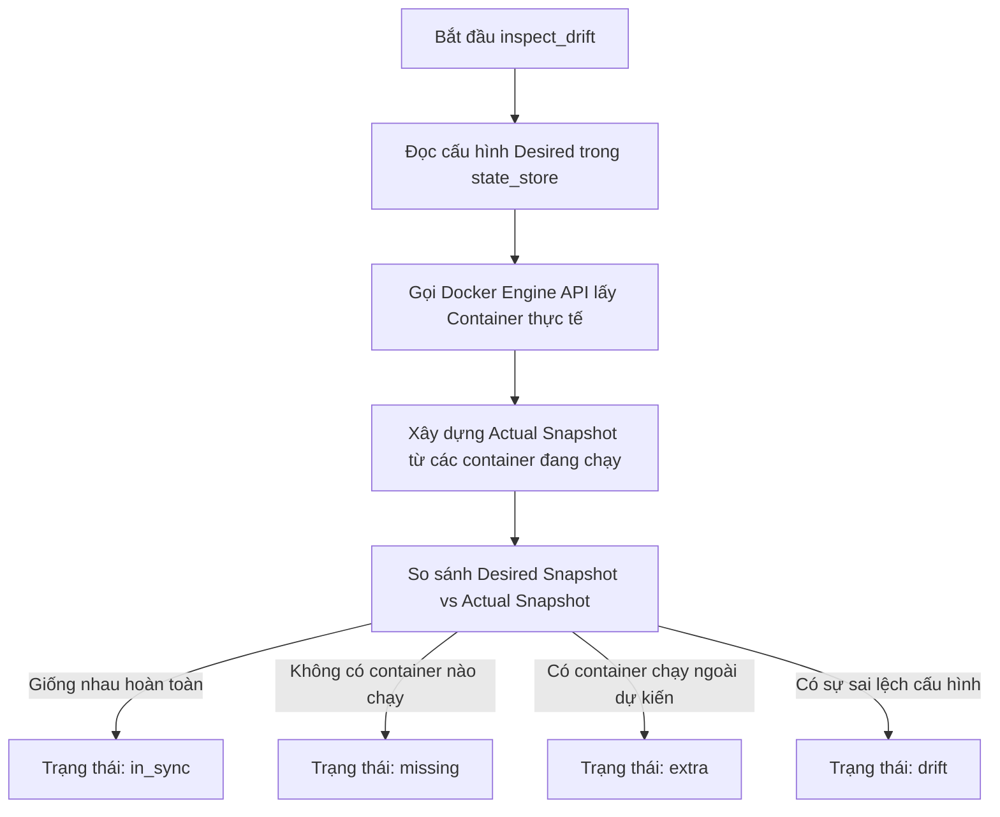

# Tài liệu Ánh xạ API Docker và Docker Agent CLI Tools
## Docker Agent API & Command Mapping Specification

Tài liệu này mô tả chi tiết sự tương quan và ánh xạ giữa các **Công cụ của Agent (Tools)**, các hàm Python tương ứng trong mã nguồn, và các lệnh **Docker CLI / Docker Engine API** được thực thi dưới nền tảng của dự án **Docker Agent CLI**.

---

## 1. Tổng quan kiến trúc tương tác Docker

Hệ thống **Docker Agent CLI** tương tác với hạ tầng Docker thông qua hai cơ chế chính:
1. **Docker Compose CLI (`docker compose`)**: Sử dụng để quản lý vòng đời của các stack ứng dụng (khởi chạy, dừng, xem log, kiểm tra trạng thái dịch vụ trong stack). Các lệnh này được gọi thông qua lớp `BoundComposeRunner` và thực thi dưới dạng một subprocess.
2. **Docker Engine API (thông qua `Docker SDK for Python`)**: Sử dụng để kiểm tra chi tiết trạng thái hệ thống, phát hiện sự sai lệch cấu hình (drift detection), xác thực sự tồn tại của image và pull image trực tiếp từ Docker Registry.



---

## 2. Bảng Ánh xạ Tổng quan (Mapping Summary)

Dưới đây là bảng tổng hợp ánh xạ từ Tool của Agent đến Hàm thực thi và Lệnh/API tương ứng của Docker:

| Tên Tool (Agent) | Danh mục | Hàm Python | Docker CLI Command tương ứng | Docker Engine API Endpoint |
| :--- | :--- | :--- | :--- | :--- |
| **`plan_stack`** | `high-level` | `src/tools/plan_stack.py` | *Không chạy trực tiếp lệnh thay đổi* | `GET /containers/json`<br>`GET /containers/{id}/json`<br>`GET /images/{name}/json` |
| **`apply_stack`** *(nội bộ)* | `high-level` | `src/tools/apply_stack.py` | `docker compose -p <stack> --project-directory <cwd> -f <yaml> up -d` | *Thông qua lệnh Docker Compose CLI* |
| **`destroy_stack`** | `high-level` | `src/tools/destroy_stack.py` | `docker compose -p <stack> --project-directory <cwd> -f <yaml> down [-v]` | *Thông qua lệnh Docker Compose CLI* |
| **`destroy_all_stacks`**| `high-level` | `src/tools/destroy_all_stacks.py` | Chạy tuần tự `docker compose down` cho từng stack | *Thông qua lệnh Docker Compose CLI* |
| **`get_stack_status`** | `read-only` | `src/tools/get_stack_status.py` | `docker compose -p <stack> ps --format json`<br>`docker compose -p <stack> logs --tail <n>` | *Thông qua lệnh Docker Compose CLI* |
| **`get_logs`** | `read-only` | `src/tools/get_logs.py` | `docker compose -p <stack> logs [--tail <n>] [--since <ts>] [<service>]` | *Thông qua lệnh Docker Compose CLI* |
| **`get_health`** | `read-only` | `src/tools/get_health.py` | *Không sử dụng CLI* | `GET /containers/json`<br>`GET /containers/{id}/json`<br>`GET /containers/{id}/stats` |
| **`inspect_drift`** | `read-only` | `src/tools/inspect_drift.py` | *Không sử dụng CLI* | `GET /containers/json`<br>`GET /containers/{id}/json` |
| **`remediate_drift`** | `high-level` | `src/tools/remediate_drift.py` | *Không chạy trực tiếp* (sinh plan → `apply_stack`) | `GET /containers/json` (qua `inspect_drift`) |
| **`pull_image`** | `escape-hatch` | `src/tools/pull_image.py` | *Không sử dụng CLI* | `GET /images/{name}/json`<br>`POST /images/create` |
| **`exec_docker`** | `escape-hatch` | `src/tools/exec_docker.py` | `docker [ps \| inspect \| logs \| images \| network ls \| volume ls]` | *Thông qua lệnh Docker CLI* |
| **`list_stacks`** | `read-only` | `src/tools/list_stacks.py` | *Không có* | *Không có (Đọc dữ liệu lưu cục bộ)* |
| **`validate_spec`** | `read-only` | `src/tools/validate_spec.py` | *Không có* | *Không có (Preflight)* |
| **`resolve_dependency`** | `read-only` | `src/tools/resolve_dependency.py` | *Không có* | *Không có (Preflight)* |
| **`check_port_conflict`** | `read-only` | `src/tools/check_port_conflict.py` | *Không có* | *Không có (Preflight)* |

---

## 3. Chi tiết từng API / Tool và Ánh xạ Docker

> [!NOTE]
> Tất cả các đường dẫn file cấu hình YAML của các stack được quản lý mặc định tại thư mục: `.docker-agent/states/<stackName>.yaml`
> Các file environment secret được lưu trữ biệt lập tại: `.docker-agent/secrets/<stackName>-<serviceName>.env`
> Project cũ có thể còn thư mục `.docker-agent/stacks/` — CLI tự đổi tên sang `states/` khi khởi tạo `state_store` nếu `states/` chưa tồn tại.

### 3.1. `plan_stack`
* **Mục đích**: Phân tích yêu cầu hạ tầng của người dùng, tự động phát hiện và sinh các khoá bảo mật (secrets), tạo cấu hình Docker Compose mong muốn (Desired State) dưới dạng YAML và tính toán drift dự kiến.
* **Hàm Python**: `src/tools/plan_stack.py`
* **Input Schema (Pydantic)**:
  ```python
  class StackDraft(BaseModel):
      stack_name: str                       # Tên stack (pattern: ^[a-z][a-z0-9_-]{0,62}$)
      intent: str                           # Mô tả yêu cầu bằng ngôn ngữ tự nhiên
      services: dict[str, DraftServiceSpec] # Khai báo các service
      networks: dict[str, Any] | None = None
      volumes: dict[str, Any] | None = None
      config_files: list[ConfigFileDraft] | None = None
  ```
* **Xử lý nội bộ (không gọi Docker)**:
  * `prepareStackDraft` / `translator` biên dịch service intent thành Compose YAML.
  * `injectDbHealthchecks` (`src/tools/shared/db_healthcheck.py`) tự động thêm healthcheck cho DB (postgres, mysql, mariadb, mongo, redis) và nâng `depends_on` lên `service_healthy`.
  * Các guard trước policy: port conflict, volume safety, DB port exposure, resource limits, missing secrets, config files.
* **Tương tác Docker Engine API**:
  * Khi tính toán drift dự kiến trước khi triển khai, tool kích hoạt `detectDrift` để so sánh cấu hình hiện tại trên Docker Host:
    * `GET /containers/json?all=true&filters={"label":["com.docker.compose.project=<stackName>"]}` (Lấy danh sách containers thuộc stack).
    * `GET /containers/{id}/json` (Lấy thông tin cấu hình thực tế của từng container).
    * `GET /images/{name}/json` (Kiểm tra xem image khai báo đã tồn tại ở local chưa để cảnh báo).

---

### 3.2. `apply_stack`
* **Mục đích**: Ghi file cấu hình Docker Compose YAML cuối cùng và tiến hành khởi chạy các container của stack.
* **Hàm Python**: `src/tools/apply_stack.py` *(chỉ dispatch nội bộ sau khi user duyệt `plan_ready`)*
* **Input Schema (Pydantic)**:
  ```python
  class ApplyStackInput(BaseModel):
      stack_name: str
      compose_yaml: str                     # Chuỗi định dạng YAML hoàn chỉnh
      scale_overrides: dict[str, int] | None = None # Cấu hình số lượng bản sao (scale)
  ```
* **Lệnh Docker CLI thực thi dưới nền**:
  ```bash
  docker compose -p <stackName> --project-directory <cwd> -f .docker-agent/states/<stackName>.yaml up -d
  ```
  *(Nếu có `scaleOverrides`, tham số `--scale <serviceName>=<count>` sẽ được bổ sung vào lệnh)*.
* **Luồng hoạt động**:
  1. Kiểm tra tính hợp lệ của Image thông qua `validateImagesForTool`.
  2. Sử dụng `gitGuard` để kiểm tra và đảm bảo các file `.env` chứa secrets không bị theo dõi bởi Git.
  3. Kiểm tra file bind-mount (`findInvalidFileBinds`) — từ chối nếu nguồn bind là thư mục hoặc chưa tồn tại.
  4. Ghi file cấu hình vào `.docker-agent/states/`.
  5. Lấy khoá lock để tránh ghi đè đồng thời.
  6. Gọi `BoundComposeRunner.up` để thực thi lệnh `docker compose up`.
  7. **Health gate:** Poll `compose ps` (mặc định 120s) cho đến khi mọi service `running`/`healthy`.
  8. **HTTP probe:** Kiểm tra cổng HTTP phổ biến (80, 443, 3000, …) trên service có publish port.
  9. Cập nhật `lastApplied` trong metadata `x-docker-agent` khi thành công.

---

### 3.3. `destroy_stack`
* **Mục đích**: Dừng và giải phóng toàn bộ tài nguyên thuộc về stack được chỉ định, sau đó lưu trữ (archive) trạng thái.
* **Hàm Python**: `src/tools/destroy_stack.py`
* **Input Schema (Pydantic)**:
  ```python
  class DestroyStackInput(BaseModel):
      stack_name: str
      remove_volumes: bool | None = None    # Có xoá volume đi kèm hay không
  ```
* **Lệnh Docker CLI thực thi dưới nền**:
  ```bash
  docker compose -p <stackName> --project-directory <cwd> -f .docker-agent/states/<stackName>.yaml down
  ```
  *(Nếu `removeVolumes: true`, tham số `-v` hoặc `--volumes` sẽ được đính kèm vào lệnh để xoá bỏ hoàn toàn volume)*.

---

### 3.4. `destroy_all_stacks`
* **Mục đích**: Hủy và dọn dẹp toàn bộ tất cả các stack đang chạy được quản lý bởi Docker Agent CLI.
* **Hàm Python**: `src/tools/destroy_all_stacks.py`
* **Input Schema (Pydantic)**:
  ```python
  class DestroyAllStacksInput(BaseModel):
      remove_volumes: bool | None = None
  ```
* **Lệnh Docker CLI thực thi dưới nền**:
  * Thực hiện lặp qua danh sách stacks được lấy ra từ `state_store` và gọi tuần tự hàm `destroyStack` tương ứng với lệnh:
  ```bash
  docker compose -p <each-stack-name> --project-directory <cwd> -f <yaml-path> down [-v]
  ```

---

### 3.5. `get_stack_status`
* **Mục đích**: Truy xuất thông tin trạng thái hoạt động thực tế của các container và dòng nhật ký (logs) gần nhất của stack.
* **Hàm Python**: `src/tools/get_stack_status.py`
* **Input Schema (Pydantic)**:
  ```python
  class GetStackStatusInput(BaseModel):
      stack_name: str
      tail_lines: int | None = None         # Số dòng log muốn lấy (mặc định: 50)
  ```
* **Lệnh Docker CLI thực thi dưới nền**:
  * Để lấy trạng thái danh sách container trong stack:
    ```bash
    docker compose -p <stackName> --project-directory <cwd> -f <yamlPath> ps --format json
    ```
  * Để lấy nhật ký hoạt động (logs):
    ```bash
    docker compose -p <stackName> --project-directory <cwd> -f <yamlPath> logs --tail <tailLines>
    ```

---

### 3.6. `inspect_drift`
* **Mục đích**: Phát hiện sự sai lệch cấu hình (Configuration Drift) giữa file Docker Compose YAML gốc và trạng thái của Container thực tế trên Docker host (do người dùng chỉnh sửa thủ công bằng lệnh ngoài).
* **Hàm Python**: `src/tools/inspect_drift.py`
* **Tương tác Docker Engine API**:
  * Hàm này gọi trực tiếp `detectDrift` trong `src/state/drift_detector.py`, sử dụng thư viện `Docker SDK for Python` để gọi hai endpoint API REST của Docker:
    1. **Liệt kê Container theo Stack**:
       * **Method/URL**: `GET /containers/json`
       * **Query Params**: `all=true`, `filters={"label":["com.docker.compose.project=<stackName>"]}`
    2. **Lấy chi tiết cấu hình container**:
       * **Method/URL**: `GET /containers/{id}/json`
  * Dữ liệu trả về từ API được phân tích và so sánh các trường: `image`, `command`, `ports`, `env` (môi trường), `volumes`, và `replicaCount` (số lượng bản sao container đang chạy).

---

### 3.7. `pull_image`
* **Mục đích**: Xác thực định dạng Image Tag và tải trước (pre-pull) các image từ Docker Hub / Docker Registry về Docker Host nếu chưa tồn tại cục bộ.
* **Hàm Python**: `src/tools/pull_image.py`
* **Input Schema (Pydantic)**:
  ```python
  class PullImageInput(BaseModel):
      image: str                            # Ví dụ: "postgres:16-alpine"
  ```
* **Tương tác Docker Engine API**:
  * Để kiểm tra sự tồn tại của Image ở Local (thông qua `imageValidator.validateImage`):
    * **Method/URL**: `GET /images/{name}/json`
  * Thực hiện tải Image từ Registry:
    * **Method/URL**: `POST /images/create`
    * **Query Params**: `fromImage=<imageName>` (ví dụ: `fromImage=postgres`) và `tag=<tagName>` (ví dụ: `tag=16-alpine`).
    * Nhận stream tiến trình tải về và xuất ra thông tin tiến độ kéo image cho Agent/User.

---

### 3.8. `exec_docker`
* **Mục đích**: Cung cấp một cổng thoát hiểm (escape hatch) cho phép Agent chạy một số lệnh kiểm tra Docker dạng chỉ đọc khi các công cụ chuyên dụng không đáp ứng được yêu cầu.
* **Hàm Python**: `src/tools/exec_docker.py`
* **Quy tắc bảo mật (Whitelist)**:
  Chỉ cho phép thực thi các lệnh Docker CLI mang tính chất đọc thông tin:
  * Lệnh đơn lẻ: `ps`, `inspect`, `logs`, `images`
  * Nhóm lệnh danh sách: `network ls`, `volume ls`
  * Bị chặn hoàn toàn (Blacklist): `rm`, `kill`, `prune`, `exec`, `stop`, `restart`, `system`.
* **Lệnh Docker CLI thực thi**:
  ```bash
  docker <...args>
  ```
  *(Ví dụ: `docker network ls` hoặc `docker images`)*.

---

### 3.9. `list_stacks`
* **Mục đích**: Trả về danh sách tất cả các stack đang hoạt động hoặc được quản lý bởi Docker Agent CLI.
* **Hàm Python**: `src/tools/list_stacks.py`
* **Mối liên hệ với Docker**:
  * Công cụ này **không gọi trực tiếp** bất kỳ lệnh Docker CLI hay Docker Engine API nào.
  * Nó tương tác với hệ thống quản lý trạng thái cục bộ `state_store` của Docker Agent CLI, đọc thông tin từ thư mục `.docker-agent/states/`.

---

### 3.10. `get_logs`
* **Mục đích**: Lấy snapshot log có giới hạn (tối đa 16 KiB UTF-8) để chẩn đoán lỗi — secrets được redact.
* **Hàm Python**: `src/tools/get_logs.py`
* **Input Schema (Pydantic)**:
  ```python
  class GetLogsInput(BaseModel):
      stack_name: str
      service: str | None = None
      tail_lines: int | None = None         # mặc định: 100
      since: str | None = None
  ```
* **Lệnh Docker CLI thực thi dưới nền**:
  ```bash
  docker compose -p <stackName> --project-directory <cwd> -f <yamlPath> logs [--tail <n>] [--since <ts>] [<service>]
  ```

---

### 3.11. `get_health`
* **Mục đích**: Truy vấn trạng thái runtime chi tiết theo container: health, CPU%, memory, restart count, crash-loop flag.
* **Hàm Python**: `src/tools/get_health.py`
* **Input Schema (Pydantic)**:
  ```python
  class GetHealthInput(BaseModel):
      stack_name: str
  ```
* **Tương tác Docker Engine API**:
  * `GET /containers/json` — lọc theo label `com.docker.compose.project=<stackName>`
  * `GET /containers/{id}/json` — inspect từng container
  * `GET /containers/{id}/stats` — CPU/memory (delta giữa hai sample)

---

## 4. Các cơ chế tích hợp đặc biệt

### 4.1. Quản lý Secrets tự động (Automated Secrets Management)
Khi một stack được lập kế hoạch qua `plan_stack`, hệ thống tự động:
1. Phát hiện các biến môi trường nhạy cảm bằng hàm `shouldRedact(key)` (ví dụ: các biến chứa `PASSWORD`, `SECRET`, `TOKEN`, `KEY`, `AUTH`).
2. Di chuyển các biến nhạy cảm này ra khỏi file cấu hình Docker Compose YAML chính để tránh lộ lọt thông tin.
3. Ghi các secrets này vào một file `.env` riêng biệt đặt tại `.docker-agent/secrets/<stackName>-<serviceName>.env`.
4. Tham chiếu file `.env` này vào thuộc tính `env_file` của service tương ứng trong Docker Compose YAML.
5. Đối với một số image phổ biến (ví dụ: `postgres`, `mysql`), hệ thống tự động sinh các giá trị ngẫu nhiên an toàn nếu người dùng chưa định nghĩa sẵn (ví dụ: `POSTGRES_PASSWORD`).

### 4.2. Drift Detection (Phát hiện sai lệch cấu hình)
Hàm `detectDrift` hoạt động theo thuật toán:


Các thuộc tính được so sánh chi tiết giữa **Desired** và **Actual**:
* **Image**: Trực tiếp so sánh tên và tag của image.
* **Command**: So sánh lệnh khởi chạy container.
* **Ports**: Đối chiếu cổng dịch vụ được ánh xạ.
* **Volumes/Binds**: So sánh danh sách thư mục mount giữa host và container.
* **Replica Count**: So sánh số lượng container thực tế so với cấu hình `scale`.
* **Environment Variables**: So sánh các biến thông thường (so sánh trực tiếp giá trị) và các biến bảo mật (so sánh bằng mã băm SHA-256 của giá trị thực tế để tránh để lộ thông tin nhạy cảm trong log).
