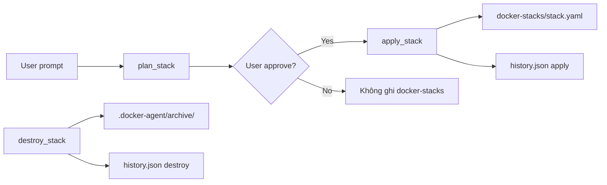

# Thư mục state theo project

Docker Agent CLI duy trì **trạng thái cục bộ theo từng project** dưới thư mục làm việc hiện tại (`cwd`) khi bạn chạy lệnh. Có **hai vị trí chính**:

| Vị trí | Vai trò |
|--------|---------|
| `docker-stacks/` | **Desired state** — file Compose YAML của từng stack (có thể commit GitOps) |
| `.docker-agent/` | Metadata runtime, secrets, sessions, locks, logs, archive — **không** chứa YAML active |

Cấu hình LLM provider toàn cục nằm ở `~/.docker-agent/` (xem [Phân biệt project-local và global](#phân-biệt-project-local-và-global)).

```text
<project>/
├── docker-stacks/           # Desired state (Compose YAML)
│   └── <stack-name>.yaml
└── .docker-agent/           # Agent metadata & runtime artifacts
    ├── archive/             # Bản lưu trữ khi destroy
    ├── sessions/            # Transcript hội thoại đã lưu
    │   ├── index.json       # Chỉ mục rút gọn cho session picker (/resume)
    │   └── <id>.json        # Bản ghi đầy đủ từng phiên (secrets đã redact)
    ├── locks/               # File lock theo stack (tránh ghi đồng thời)
    ├── secrets/             # File .env theo stack/service (quyền 0700)
    ├── logs/                # Log có cấu trúc của agent (StructuredLogger)
    └── history.json         # Audit log dạng JSONL
```

Thư mục được tạo tự động khi `state_store` hoặc `session_store` khởi tạo — thường là lần đầu bạn chạy `docker-agent` trong project.

---

## `docker-stacks/` — Desired state

Mỗi stack được quản lý có một file YAML **ở root project**, không nằm trong `.docker-agent/`:

```text
docker-stacks/<stack-name>.yaml
```

File này là **bản thiết kế Compose mong muốn** hiện tại, kèm metadata trong khóa `x-docker-agent`:

| Trường | Ý nghĩa |
|--------|---------|
| `name` | Tên stack |
| `createdAt` | Thời điểm tạo bản ghi |
| `lastApplied` | Lần `apply` gần nhất (`null` nếu chưa apply) |
| `intent` | Mô tả ý định deploy |
| `provider` | LLM provider đã dùng khi tạo |
| `generatedBy` | Nguồn sinh ra (thường là agent/tool) |
| `envFileSources` | Map service → đường dẫn file env và keys đã thêm |

Phần `services` tuân theo schema Docker Compose (image, ports, volumes, healthcheck, `deploy.resources`, v.v.).

**Ai đọc/ghi:** `state_store`, các tool `plan_stack` / `apply_stack` / `destroy_stack`, và slash commands như `/yaml`, `/status`, `/logs`.

`docker compose` chạy với `-f docker-stacks/<stack>.yaml` và `--project-directory <cwd>`.

#### Migration từ layout cũ

Project cũ có thể còn `.docker-agent/stacks/`. Khi khởi tạo, CLI tự **đổi tên** sang `docker-stacks/` ở root project nếu `docker-stacks/` chưa tồn tại.

---

## `.docker-agent/` — Metadata & runtime

### `archive/` — Bản lưu trữ stack

Khi một stack bị **destroy** (mặc định), file YAML active được chuyển từ `docker-stacks/` vào đây:

- `<stack>-<timestamp>.yaml` — lịch sử đầy đủ theo thời gian
- `<stack>.yaml` — bản archive ổn định (bản mới nhất)

Dùng cho rollback và tra cứu cấu hình cũ.

---

### `sessions/` — Phiên hội thoại

Mỗi lượt tương tác trong REPL được lưu sau khi hoàn thành. Cấu trúc một bản ghi (`<id>.json`):

```json
{
  "schema_version": 1,
  "id": "<uuid>",
  "created_at": "2026-06-23T10:00:00.000Z",
  "updated_at": "2026-06-23T10:05:00.000Z",
  "cwd": "/path/to/project",
  "provider": "gemini",
  "model": "optional-model-id",
  "first_prompt": "Deploy nginx stack",
  "stack_names": ["webapp"],
  "messages": []
}
```

| Trường | Ý nghĩa |
|--------|---------|
| `schema_version` | Phiên bản schema (hiện tại `1`) |
| `id` | UUID phiên |
| `created_at` | Thời điểm tạo — **không đổi** qua các lần lưu lại |
| `updated_at` | Thời điểm cập nhật gần nhất |
| `cwd` | Thư mục làm việc khi phiên được tạo |
| `provider` | LLM provider đã dùng |
| `model` | Model override (tùy chọn) |
| `first_prompt` | Prompt người dùng đầu tiên trong phiên |
| `stack_names` | Các stack đang quản lý tại thời điểm lưu |
| `messages` | Transcript hội thoại (user / assistant / tool) |

- `messages` đã qua **secret redactor** trước khi ghi đĩa (giá trị nhạy cảm thành `***`).
- `stack_names` lấy từ các file trong `docker-stacks/` tại thời điểm lưu.

#### `index.json`

Danh sách rút gọn để REPL hiển thị **session picker** khi gõ `/resume` (sắp xếp mới nhất trước):

```json
[
  {
    "id": "<uuid>",
    "created_at": "2026-06-23T10:00:00.000Z",
    "updated_at": "2026-06-23T10:05:00.000Z",
    "first_prompt": "Deploy nginx stack",
    "stack_names": ["webapp"]
  }
]
```

`session_store.list()` đọc `index.json`; `session_store.read(id)` nạp transcript đầy đủ từ `<id>.json`.

#### Khôi phục phiên

| Cách | Hành vi |
|------|---------|
| `/resume` (REPL) | Mở picker liệt kê phiên đã lưu; chọn bằng `↑/↓` + `Enter` |
| `--resume` (CLI) | Khôi phục phiên **mới nhất** ngay khi khởi động |
| `--resume <id>` (CLI) | Khôi phục phiên theo id cụ thể |

Khi khôi phục, CLI nạp lại `messages[]` và `model` đã lưu. Dialog permission đang chờ **không** được resume.

**Lưu ý:** Resume session từ `cwd` khác sẽ cảnh báo — đường dẫn stack có thể không khớp. Footer REPL hiển thị `session: <id>` của phiên đang active.

---

### `locks/` — Khóa theo stack

File `<stack-name>.lock` chứa PID process đang giữ lock. `state_store.acquire_lock()` dùng để tránh hai thao tác `apply`/`destroy` đồng thời trên cùng stack.

Lock **stale** (process không còn sống) được tự động dọn.

---

### `secrets/` — Biến môi trường nhạy cảm

File env được tạo với pattern:

```text
secrets/<stack-name>-<service-name>.env
```

- Thư mục tạo với quyền `0700`.
- Tham chiếu trong Compose dạng `./.docker-agent/secrets/<stack>-<service>.env`.
- Giá trị secret **không** ghi vào `docker-stacks/*.yaml` — chỉ lưu đường dẫn file.

`apply_stack` từ chối nếu file env đang bị git track (bảo vệ khỏi commit nhầm).

---

### `logs/` — Log agent có cấu trúc

`StructuredLogger` ghi log phiên agent vào đây (khởi tạo từ REPL). Dùng cho debug và audit hành vi tool, không phải log container Docker.

---

### `history.json` — Audit log (JSONL)

Mỗi dòng là một sự kiện JSON:

| Trường | Ý nghĩa |
|--------|---------|
| `ts` | Timestamp ISO |
| `sessionId` | ID phiên agent |
| `stackName` | Stack liên quan |
| `action` | Loại hành động |
| `details` | Metadata bổ sung |

Các giá trị `action`:

| Action | Khi nào ghi |
|--------|-------------|
| `plan` | Sau khi lập kế hoạch stack |
| `apply` | Sau khi apply thành công |
| `destroy` | Sau khi destroy stack |
| `drift_detected` | Phát hiện lệch trạng thái |
| `rollback` | Rollback sau apply thất bại |
| `remediate` | Khắc phục drift |

File append-only — phù hợp để grep hoặc ingest vào hệ thống log.

---

## Phân biệt project-local và global

| Vị trí | Mục đích |
|--------|----------|
| `<project>/docker-stacks/` | Desired state YAML **của project này** |
| `<project>/.docker-agent/` | Archive, sessions, secrets, locks, logs, history |
| `~/.docker-agent/config.json` | Cấu hình user (provider, model, theme, defaults). `/model` ghi provider + model vào đây |
| `~/.docker-agent/policies.yaml` | Policy **toàn cục** (áp dụng mọi project) |
| `~/.docker-agent/api-keys/` | API keys (Windows; macOS/Linux dùng keychain) |

Override đường dẫn:

- `DOCKER_AGENT_CONFIG` — file config JSON
- `DOCKER_AGENT_SECRET_DIR` — thư mục lưu API keys (Windows)

---

## Legacy: `policies.yaml` trong `.docker-agent`

Phiên bản cũ lưu policy project tại:

```text
.docker-agent/policies.yaml
```

Hiện tại **khuyến nghị** dùng `project-policies.yaml` ở **root project**. Nếu vẫn còn file legacy, CLI vẫn đọc được nhưng in cảnh báo migration.

Chi tiết policy: xem [policies.md](./policies.md). Agent tools và session persistence: xem [agent-tools.md](./agent-tools.md).

---

## Vòng đời dữ liệu



1. **Plan** — agent sinh YAML (kèm auto-inject healthcheck DB), user xem preview.
2. **Apply** — ghi `docker-stacks/<stack>.yaml`, chạy `docker compose up`, chờ health gate (mặc định 120s), probe HTTP nếu có cổng public.
3. **Drift** — so sánh desired (`docker-stacks/`) vs running; có thể remediate.
4. **Destroy** — `compose down`, archive YAML vào `.docker-agent/archive/`, xóa file active.

---

## Bảo mật và Git

**Nên thêm vào `.gitignore`:**

```gitignore
.docker-agent/
```

**Có thể commit (GitOps):**

- `docker-stacks/*.yaml` — desired state; chuẩn thiết kế không chứa secret inline (secret nằm trong `.docker-agent/secrets/`)

**Không commit:**

- Toàn bộ `.docker-agent/` (secrets, sessions, logs, locks)
- File trong `.docker-agent/secrets/`
- Transcript `sessions/` (có thể còn metadata nhạy cảm)

---

## API trong code

| Hàm / lớp | Vai trò |
|-----------|---------|
| `project_state_dir(cwd)` | Trả về `<cwd>/.docker-agent` |
| `stack_states_dir(cwd)` | Trả về `<cwd>/docker-stacks` |
| `stack_state_yaml_path(cwd, name)` | Đường dẫn file YAML của một stack |
| `state_store` | CRUD `docker-stacks/`, archive, locks, history, summary cho system prompt |
| `session_store` | Lưu/đọc phiên; `list()` phục vụ picker `/resume`; `latest()` / `read(id)` phục vụ `--resume` |