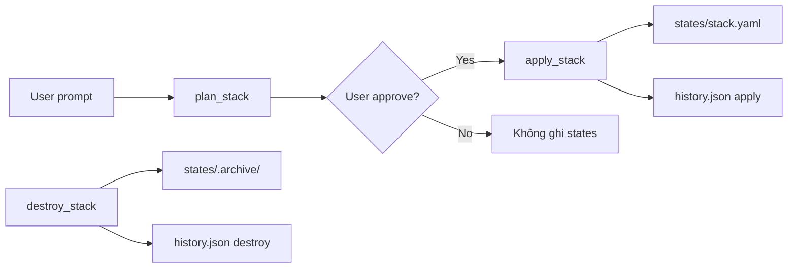

# Thư mục `.docker-agent`

Docker Agent CLI duy trì **trạng thái cục bộ theo từng project** trong thư mục ẩn `.docker-agent/`, nằm ngay dưới thư mục làm việc hiện tại (`cwd`) khi bạn chạy lệnh.

Thư mục này là nơi lưu **trạng thái mong muốn** (desired state) của các Docker stack, lịch sử thao tác, phiên hội thoại, secrets, và các artifact phụ trợ. Nó **không** chứa cấu hình LLM provider toàn cục — phần đó nằm ở `~/.docker-agent/` (xem [Phân biệt project vs global](#phân-biệt-project-local-và-global)).

---

## Cấu trúc thư mục

```text
.docker-agent/
├── states/              # YAML trạng thái mong muốn của từng stack
│   └── .archive/        # Bản lưu trữ khi destroy hoặc ghi đè
├── sessions/            # Transcript hội thoại đã lưu
│   ├── index.json       # Chỉ mục cho /sessions và /resume
│   └── <id>.json        # Bản ghi từng phiên (secrets đã redact)
├── locks/               # File lock theo stack (tránh ghi đồng thời)
├── secrets/             # File .env theo stack/service (quyền 0700)
├── logs/                # Log có cấu trúc của agent (StructuredLogger)
└── history.json         # Audit log dạng JSONL
```

Thư mục được tạo tự động khi `StateStore` hoặc `SessionStore` khởi tạo — thường là lần đầu bạn chạy `docker-agent` trong project.

---

## Chi tiết từng thành phần

### `states/` — Trạng thái mong muốn

Mỗi stack được quản lý có một file YAML:

```text
states/<stack-name>.yaml
```

File này là **bản thiết kế Compose mong muốn** hiện tại, kèm metadata trong khóa `x-docker-agent`:

| Trường | Ý nghĩa |
|--------|---------|
| `name` | Tên stack |
| `createdAt` | Thời điểm tạo bản ghi |
| `lastApplied` | Lần `apply` gần nhất (`null` nếu chưa apply) |
| `intent` | Mô tả ý định deploy |
| `provider` | LLM provider đã dùng khi tạo |
| `generatedBy` | Nguồn sinh ra (thường là agent/tool) |
| `envFileSources` | Map service → đường dẫn file env và keys đã thêm |

Phần `services` tuân theo schema Docker Compose (image, ports, volumes, healthcheck, `deploy.resources`, v.v.).

**Ai đọc/ghi:** `StateStore`, các tool `plan_stack` / `apply_stack` / `destroy_stack`, và slash commands như `/yaml`, `/status`, `/logs`.

#### `states/.archive/`

Khi một stack bị **destroy** (mặc định), file YAML active được chuyển vào archive:

- `<stack>-<timestamp>.yaml` — lịch sử đầy đủ theo thời gian
- `<stack>.yaml` — bản archive ổn định (bản mới nhất)

Dùng cho rollback và tra cứu cấu hình cũ.

#### Migration từ `stacks/` (phiên bản cũ)

Project cũ có thể còn thư mục `.docker-agent/stacks/`. Khi khởi tạo, CLI tự **đổi tên** sang `states/` nếu `states/` chưa tồn tại.

---

### `sessions/` — Phiên hội thoại

Mỗi lượt tương tác trong REPL được lưu sau khi hoàn thành. Cấu trúc một bản ghi (`<id>.json`):

```json
{
  "schemaVersion": 1,
  "id": "<uuid>",
  "createdAt": "2026-06-23T10:00:00.000Z",
  "updatedAt": "2026-06-23T10:05:00.000Z",
  "cwd": "/path/to/project",
  "provider": "gemini",
  "model": "optional-model-id",
  "firstPrompt": "Deploy nginx stack",
  "stackNames": ["webapp"],
  "messages": []
}
```

- `messages` đã qua **secret redactor** trước khi ghi đĩa (giá trị nhạy cảm thành `***`).
- `index.json` chứa danh sách rút gọn để `/sessions` liệt kê nhanh (sắp xếp mới nhất trước).

**Lưu ý:** Resume session từ `cwd` khác sẽ cảnh báo — đường dẫn stack có thể không khớp.

---

### `locks/` — Khóa theo stack

File `<stack-name>.lock` chứa PID process đang giữ lock. `StateStore.acquireLock()` dùng để tránh hai thao tác `apply`/`destroy` đồng thời trên cùng stack.

Lock **stale** (process không còn sống) được tự động dọn.

---

### `secrets/` — Biến môi trường nhạy cảm

File env được tạo với pattern:

```text
secrets/<stack-name>-<service-name>.env
```

- Thư mục tạo với quyền `0700`.
- Tham chiếu trong Compose dạng `./.docker-agent/secrets/<stack>-<service>.env`.
- Giá trị secret **không** ghi vào `states/*.yaml` — chỉ lưu đường dẫn file.

`apply_stack` từ chối nếu file env đang bị git track (bảo vệ khỏi commit nhầm).

---

### `logs/` — Log agent có cấu trúc

`StructuredLogger` ghi log phiên agent vào đây (khởi tạo từ REPL). Dùng cho debug và audit hành vi tool, không phải log container Docker.

---

### `history.json` — Audit log (JSONL)

Mỗi dòng là một sự kiện JSON:

| Trường | Ý nghĩa |
|--------|---------|
| `ts` | Timestamp ISO |
| `sessionId` | ID phiên agent |
| `stackName` | Stack liên quan |
| `action` | Loại hành động |
| `details` | Metadata bổ sung |

Các giá trị `action`:

| Action | Khi nào ghi |
|--------|-------------|
| `plan` | Sau khi lập kế hoạch stack |
| `apply` | Sau khi apply thành công |
| `destroy` | Sau khi destroy stack |
| `drift_detected` | Phát hiện lệch trạng thái |
| `rollback` | Rollback sau apply thất bại |
| `remediate` | Khắc phục drift |

File append-only — phù hợp để grep hoặc ingest vào hệ thống log.

---

## Phân biệt project-local và global

| Vị trí | Mục đích |
|--------|----------|
| `<project>/.docker-agent/` | Trạng thái stack, sessions, secrets **của project này** |
| `~/.docker-agent/config.json` | Cấu hình user (provider, model, defaults) |
| `~/.docker-agent/policies.yaml` | Policy **toàn cục** (áp dụng mọi project) |
| `~/.docker-agent/api-keys/` | API keys (Windows; macOS/Linux dùng keychain) |

Override đường dẫn:

- `DOCKER_AGENT_CONFIG` — file config JSON
- `DOCKER_AGENT_SECRET_DIR` — thư mục lưu API keys (Windows)

---

## Legacy: `policies.yaml` trong `.docker-agent`

Phiên bản cũ lưu policy project tại:

```text
.docker-agent/policies.yaml
```

Hiện tại **khuyến nghị** dùng `project-policies.yaml` ở **root project**. Nếu vẫn còn file legacy, CLI vẫn đọc được nhưng in cảnh báo migration.

Chi tiết policy: xem [policies.md](./policies.md).

---

## Vòng đời dữ liệu



1. **Plan** — agent sinh YAML (kèm auto-inject healthcheck DB), user xem preview.
2. **Apply** — ghi `states/<stack>.yaml`, chạy `docker compose up`, chờ health gate (mặc định 120s), probe HTTP nếu có cổng public.
3. **Drift** — so sánh desired vs running; có thể remediate.
4. **Destroy** — `compose down`, archive YAML, xóa file active.

---

## Bảo mật và Git

**Nên thêm vào `.gitignore`:**

```gitignore
.docker-agent/secrets/
.docker-agent/sessions/
.docker-agent/logs/
.docker-agent/locks/
```

**Có thể commit (tùy team):**

- `states/*.yaml` — nếu không chứa secret inline (chuẩn thiết kế: secret nằm trong `secrets/`)

**Không commit:**

- File trong `secrets/`
- Transcript `sessions/` (có thể còn metadata nhạy cảm)

---

## API trong code

| Hàm / lớp | Vai trò |
|-----------|---------|
| `projectStateDir()` | Trả về `<cwd>/.docker-agent` |
| `stackStatesDir(cwd)` | Trả về `<cwd>/.docker-agent/states` |
| `stackStateYamlPath(cwd, name)` | Đường dẫn file YAML của một stack |
| `StateStore` | CRUD states, locks, history, summary cho system prompt |
| `SessionStore` | Lưu/đọc/resume sessions |