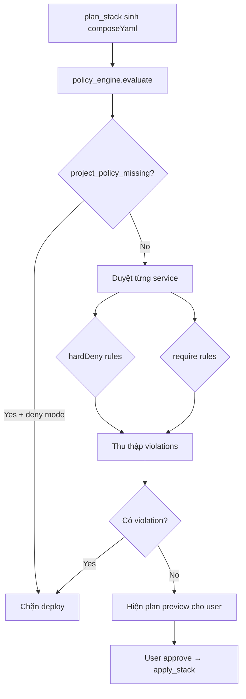

# Hệ thống Policy

Docker Agent CLI áp dụng **policy dạng khai báo (YAML)** để kiểm soát stack Docker Compose trước khi deploy. Policy chặn cấu hình không an toàn hoặc không tuân chuẩn **trước** khi chạy `docker compose up`.

Policy được đánh giá bởi `policy_engine` khi:

- Agent gọi `plan_stack` (sau khi sinh YAML, trước khi user approve)
- Agent gọi `remediate_drift` (trước khi apply bản khắc phục)

Mọi vi phạm policy đều là blocker: nếu `policy_engine.evaluate()` trả về violation, deployment/remediation bị chặn trước khi user approve.

---

## Vị trí file policy

| Phạm vi | Đường dẫn mặc định | Ghi chú |
|---------|-------------------|---------|
| **Global** | `~/.docker-agent/policies.yaml` | Áp dụng cho mọi project; **tự tạo baseline** lần chạy đầu nếu chưa có |
| **Project** | `<project>/project-policies.yaml` | Đặt ở root repo |

### Global policy — khởi tạo tự động

Lần đầu `PolicyEngine` chạy (khi CLI deploy/plan), nếu `~/.docker-agent/policies.yaml` chưa tồn tại, CLI **tự tạo** file baseline bảo mật (cùng nội dung mục [Global — baseline bảo mật](#global--baseline-bảo-mật) bên dưới). File đã có sẵn **không bị ghi đè**.

Override đường dẫn: biến môi trường `DOCKER_AGENT_GLOBAL_POLICY`.

---

## Cấu trúc file YAML

```yaml
schemaVersion: "1"   # tùy chọn

global:
  hardDeny:
    - <rule>
  require:
    - <rule>

project:
  hardDeny:
    - <rule>
  require:
    - <rule>
```

- `global` — định nghĩa trong `~/.docker-agent/policies.yaml`
- `project` — định nghĩa trong `project-policies.yaml`

Cả hai nhóm được **merge**: rule từ global và project đều có hiệu lực. Project policy **không được nới lỏng** global policy (xem [Hierarchy](#hierarchy-global-và-project)).

---

## Hierarchy global và project

Khi cả global và project đều có rule có tham số, project chỉ được **siết chặt hơn**:

| Rule | Ràng buộc |
|------|-----------|
| `resource_limits` | Không tắt `cpuRequired`/`memoryRequired` nếu global bật; `maxMemory` project ≤ global |
| `logging_rotation` | `maxSize`, `maxFiles` project ≤ global |
| `healthcheck` | Không tắt `required` nếu global bật; interval/timeout project ≤ global |
| `untrusted_registry` | `allowedRegistries` project phải là **tập con** của global |
| `pids_limit` | Không tắt `required` nếu global bật; `maxPids` project ≤ global |

Vi phạm hierarchy → `policy_engine` throw lỗi khi khởi tạo (CLI không chạy được với config sai).

---

## Khi thiếu project policy

Hành vi phụ thuộc `defaults.missingProjectPolicy` trong `~/.docker-agent/config.json`:

| Giá trị | Hành vi |
|---------|---------|
| `deny` (**mặc định**) | Mọi deploy bị chặn với rule `project_policy_missing` |
| `use-global` | Chỉ áp dụng global policy; không bắt buộc file project |

Khi `deny` và file project chưa tồn tại, CLI có thể **đề xuất tạo** `project-policies.yaml` mặc định (sau khi user approve permission `initialize_project_policy`):

```yaml
project:
  hardDeny: []
  require: []
```

---

## Nhóm `hardDeny` — Cấm tuyệt đối

Các rule dạng chuỗi đơn giản — thêm vào danh sách `hardDeny`:

| Rule | Mô tả | Điều kiện vi phạm |
|------|-------|-------------------|
| `privileged_containers` | Cấm container privileged | `privileged: true` |
| `mount_docker_socket` | Cấm mount Docker socket | volume host `/var/run/docker.sock` |
| `mount_host_root` | Cấm mount thư mục hệ thống | host path là `/`, `/etc`, `/root`, `/usr`, `/var` |
| `host_pid_namespace` | Cấm dùng PID namespace host | `pid: host` |
| `host_network` | Cấm host network mode | `network_mode: host` |
| `add_all_linux_capabilities` | Cấm thêm toàn bộ capability | `cap_add` chứa `ALL` hoặc `all` |
| `disable_seccomp` | Cấm tắt seccomp | `security_opt` chứa `seccomp:unconfined` |
| `expose_database_publicly` | Cấm expose DB ra ngoài localhost | Image DB (postgres, mysql, redis, …) + port không bind `127.0.0.1:` |
| `untrusted_registry` | Chỉ cho phép registry trong whitelist | Xem cấu hình bên dưới |
| `wildcard_host_ports` *(opt-in)* | Cấm publish port ra mọi interface | Port dạng `8080:80`, `0.0.0.0:8080:80`, hoặc dict thiếu `host_ip` |
| `inline_sensitive_env` *(opt-in)* | Cấm ghi literal secret trong `environment` | Key khớp password/secret/token/api-key/access-key/private-key (trừ `*_FILE`, `${...}`) |
| `disable_apparmor` *(opt-in)* | Cấm tắt AppArmor | `security_opt` chứa `apparmor:unconfined` |
| `disable_selinux_label` *(opt-in)* | Cấm tắt SELinux label | `security_opt` chứa `label:disable` |

### `untrusted_registry` (có tham số)

```yaml
hardDeny:
  - untrusted_registry:
      allowedRegistries:
        - docker.io
        - gcr.io
        - ghcr.io
```

- Image không có registry rõ ràng → mặc định `docker.io`
- Registry phải nằm trong `allowedRegistries`, nếu không → vi phạm `deny`

---

## Nhóm `require` — Bắt buộc

### Rule đơn giản (không tham số)

Các rule trong `require` là baseline bắt buộc. Nếu vi phạm, deployment/remediation bị chặn.

| Rule | Mô tả | Điều kiện vi phạm |
|------|-------|-------------------|
| `restart_policy` | Phải có restart policy | Thiếu `restart` hoặc `restart: no` |
| `non_root_user` | Phải chạy non-root | Thiếu `user` |
| `project_labels` | Phải có labels | Thiếu `labels` |
| `no_new_privileges` *(opt-in)* | Ngăn leo quyền trong container | Thiếu `security_opt: no-new-privileges:true` |
| `drop_all_capabilities` *(opt-in)* | Drop toàn bộ capability trước khi add lại | Thiếu `cap_drop: [ALL]` |
| `read_only_root_filesystem` *(opt-in)* | Root filesystem phải read-only | Thiếu `read_only: true` |
| `pinned_image_tag` *(opt-in)* | Image phải có tag cố định hoặc digest | Dùng `nginx`, `nginx:latest` thay vì tag/digest rõ ràng |

### Rule có tham số

#### `resource_limits`

```yaml
require:
  - resource_limits:
      cpuRequired: true
      memoryRequired: true
      maxMemory: 4GiB
```

| Tham số | Kiểm tra |
|---------|----------|
| `cpuRequired` | Bắt buộc `deploy.resources.limits.cpus` |
| `memoryRequired` | Bắt buộc `deploy.resources.limits.memory` |
| `maxMemory` | Memory limit không vượt ngưỡng (hỗ trợ `k`, `m`, `g`, `GiB`, …) |

#### `logging_rotation`

```yaml
require:
  - logging_rotation:
      maxSize: 10m
      maxFiles: 3
```

| Tham số | Kiểm tra |
|---------|----------|
| — | Bắt buộc `logging.driver: json-file` |
| `maxSize` | `logging.options.max-size` phải có và ≤ ngưỡng |
| `maxFiles` | `logging.options.max-file` phải có và ≤ ngưỡng |

#### `healthcheck`

```yaml
require:
  - healthcheck:
      required: true
      maxIntervalSeconds: 30
      maxTimeoutSeconds: 5
```

| Tham số | Kiểm tra |
|---------|----------|
| `required` | Phải có `healthcheck.test`, không `disable: true` |
| `maxIntervalSeconds` | `healthcheck.interval` ≤ ngưỡng (hỗ trợ `s`, `m`, `h`) |
| `maxTimeoutSeconds` | `healthcheck.timeout` ≤ ngưỡng |

#### `pids_limit` *(opt-in)*

```yaml
require:
  - pids_limit:
      required: true
      maxPids: 512
```

| Tham số | Kiểm tra |
|---------|----------|
| `required` | Bắt buộc trường `pids_limit` trên service |
| `maxPids` | Giá trị `pids_limit` không vượt ngưỡng |

---

## Rule opt-in và baseline mặc định

Baseline global mặc định (`~/.docker-agent/policies.yaml` khi tự tạo lần đầu) vẫn giữ **9 rule `hardDeny` + 3 rule `require`** như trước. Các rule đánh dấu *(opt-in)* ở trên chỉ có hiệu lực khi bạn **chủ động thêm** vào global hoặc project policy.

Ví dụ siết thêm cho project:

```yaml
project:
  hardDeny:
    - wildcard_host_ports
    - inline_sensitive_env
  require:
    - no_new_privileges
    - drop_all_capabilities
    - read_only_root_filesystem
    - pinned_image_tag
    - pids_limit:
        required: true
        maxPids: 256
```

---

## Ngoài phạm vi Policy Engine hiện tại

Policy Engine chỉ đánh giá **Docker Compose YAML** (cấu hình service/stack). Các khuyến nghị host/daemon/CI từ tài liệu bảo mật Docker **không** được enforce tự động bởi policy YAML, ví dụ:

- Cập nhật Docker Engine / kernel host (Rule #0)
- Cấu hình daemon TCP socket, log level daemon (Rule #10)
- Rootless mode / user namespace remap ở daemon (Rule #11)
- Quét image, SBOM, ký image trong CI/CD (Rule #9, #13)

Các mục này nên được vận hành ở tầng hạ tầng/CI; Policy Engine bổ sung guard ở tầng Compose khi team opt-in các rule tương ứng.

---

## Kết quả đánh giá

Mỗi vi phạm có dạng:

```python
class PolicyViolation(BaseModel):
    service: str                 # tên service, hoặc "*" cho lỗi toàn cục
    rule: str                    # tên rule
    message: str                 # mô tả lỗi
```

### Rule đặc biệt (không khai báo trong YAML)

| Rule | Khi nào |
|------|---------|
| `project_policy_missing` | Thiếu project policy và `missingProjectPolicy: deny` |
| `invalid_yaml` | YAML Compose không parse được |

Thông báo lỗi gửi về agent dạng:

```text
Policy violation(s) detected. Deployment is blocked:
[web] non_root_user: Running as non-root user (e.g., user: '1000:1000') is required
```

---

## Ví dụ cấu hình đầy đủ

### Global — baseline bảo mật

File: `~/.docker-agent/policies.yaml`

```yaml
schemaVersion: "1"

global:
  hardDeny:
    - privileged_containers
    - mount_docker_socket
    - mount_host_root
    - host_pid_namespace
    - host_network
    - add_all_linux_capabilities
    - disable_seccomp
    - untrusted_registry:
        allowedRegistries:
          - docker.io
          - gcr.io
    - expose_database_publicly
  require:
    - restart_policy
    - resource_limits:
        memoryRequired: true
        maxMemory: 8GiB
    - logging_rotation:
        maxSize: 50m
        maxFiles: 5
```

### Project — siết thêm theo team

File: `<project>/project-policies.yaml`

```yaml
schemaVersion: "1"

project:
  hardDeny:
    - mount_docker_socket   # nhấn mạnh thêm (đã có ở global)
  require:
    - non_root_user
    - healthcheck:
        required: true
        maxIntervalSeconds: 30
    - project_labels
    - resource_limits:
        cpuRequired: true
        maxMemory: 2GiB      # siết hơn global 8GiB — hợp lệ
```

---

## Luồng kiểm tra trong agent



`plan_stack` còn có các guard **không thuộc policy YAML** (port conflict, volume safety, DB port exposure, missing secrets, resource limits, v.v.) — chạy **trước** bước `policy_engine.evaluate`. Ngoài ra, `injectDbHealthchecks` tự động thêm healthcheck cho DB (postgres, mysql, mariadb, mongo, redis) và nâng `depends_on` lên `service_healthy` trước khi đánh giá policy. Policy là lớp kiểm soát **sau** khi YAML đã hợp lệ về mặt cấu trúc.

---

## Cấu hình liên quan

Trong `~/.docker-agent/config.json`:

```json
{
  "provider": "gemini",
  "defaults": {
    "autoApproveNonDestructive": false,
    "missingProjectPolicy": "deny"
  }
}
```

| Trường | Ảnh hưởng policy |
|--------|------------------|
| `missingProjectPolicy` | `deny` hoặc `use-global` khi thiếu `project-policies.yaml` |

---

## Tham chiếu code

| File | Nội dung |
|------|----------|
| `src/policy/policy_engine.py` | Load, merge, validate, evaluate policy |
| `src/policy/types.py` | Type definitions |
| `src/query.py` | Gọi `evaluate()` trong `plan_stack` và `remediate_drift` |
| `src/policy/__tests__/policy_engine.test.py` | Test cases cho từng rule |